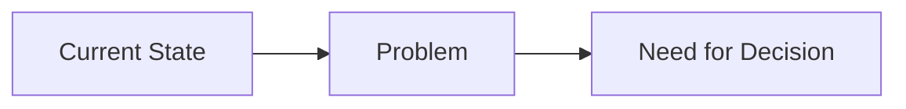

# ADR Template

**Status:** [Proposed | Accepted | Deprecated | Superseded]
**Date:** YYYY-MM-DD
**Context:** [Brief problem statement]
**Decision:** [Clear statement of decision]

---

## Context

[Describe the problem or opportunity that this decision addresses. Include:]

- **Current State:** What is the current situation?
- **Problem:** What problem are we trying to solve?
- **Constraints:** What constraints must we consider?
- **Scope:** What is in and out of scope?

**Context Diagram (if applicable):**


---

## Decision

[State the decision clearly and concisely. What are we going to do?]

**Implementation:**
- [ ] Technology/Framework selected: ___________
- [ ] Key libraries: ___________
- [ ] Configuration approach: ___________
- [ ] Migration strategy: ___________

---

## Rationale

[Explain why this decision was made. Include trade-offs and alternatives considered.]

### Alternatives Considered

| Option | Pros | Cons | Decision |
|--------|------|------|----------|
| **Chosen** | ✓ Benefits | ✗ Drawbacks | ✅ Selected |
| Alternative A | • Pro 1<br>• Pro 2 | • Con 1<br>• Con 2 | ❌ Rejected |
| Alternative B | • Pro 1 | • Con 1<br>• Con 2 | ❌ Rejected |

### Key Benefits

1. **Benefit 1:** [Description]
2. **Benefit 2:** [Description]
3. **Benefit 3:** [Description]

### Trade-offs

- **Trade-off 1:** [Description of what we're giving up]
- **Trade-off 2:** [Description of what we're giving up]

---

## Performance Validation

> **Note:** This section documents performance expectations and validation.

| Metric | Target | Actual (Date) | Status |
|--------|--------|--------------|--------|
| **Metric 1** | value | TBD | 📊 To be measured |
| **Metric 2** | value | TBD | 📊 To be measured |

**Benchmark Plan:**
- Benchmark suite: [link to benchmark file]
- Test data: [description]
- Measurement method: [description]

---

## Consequences

### Positive Impacts

1. **Impact 1:** [Description of positive outcome]
2. **Impact 2:** [Description of positive outcome]

### Negative Impacts

1. **Impact 1:** [Description of negative outcome]
2. **Impact 2:** [Description of negative outcome]

### Migration Strategy

[If this is a change from existing system, how do we migrate?]

**Steps:**
1. Step 1: [Description]
2. Step 2: [Description]
3. Step 3: [Description]

**Rollback Plan:**
- If migration fails: [Rollback approach]

---

## Related Decisions

- [ADR XXXX](./XXXX-title.md): [Related decision - context]
- [ADR XXXX](./XXXX-title.md): [Related decision - dependency]

---

## Implementation

### Code Locations

**Primary Implementation:**
- File: [`src/path/to/file.rs`](../../src/path/to/file.rs)
- Component: [Component name]
- Tests: [`tests/path/to/test.rs`](../../tests/path/to/test.rs)

**Configuration:**
- File: `config/config.toml`
- Section: `[section_name]`

### API Changes

**New Endpoints (if applicable):**
- `METHOD /path/to/endpoint` - [Description]

**Data Structures:**
```rust
pub struct ExampleStruct {
    pub field: Type,
}
```

### Testing

**Test Coverage:**
- Unit tests: [`tests/unit_test.rs`](../../tests/unit_test.rs)
- Integration tests: [`tests/integration_test.rs`](../../tests/integration_test.rs)
- Benchmarks: [`benches/benchmark_name.rs`](../../benches/benchmark_name.rs)

**Validation Criteria:**
- [ ] Test coverage > 80%
- [ ] All tests pass
- [ ] Benchmarks meet targets

---

## References

- [Documentation link](https://example.com)
- [Research paper](https://example.com)
- [RFC/Standard](https://example.com)

---

**Authors:** [Name, email]
**Reviewers:** [Name, email]
**Approval Date:** YYYY-MM-DD
