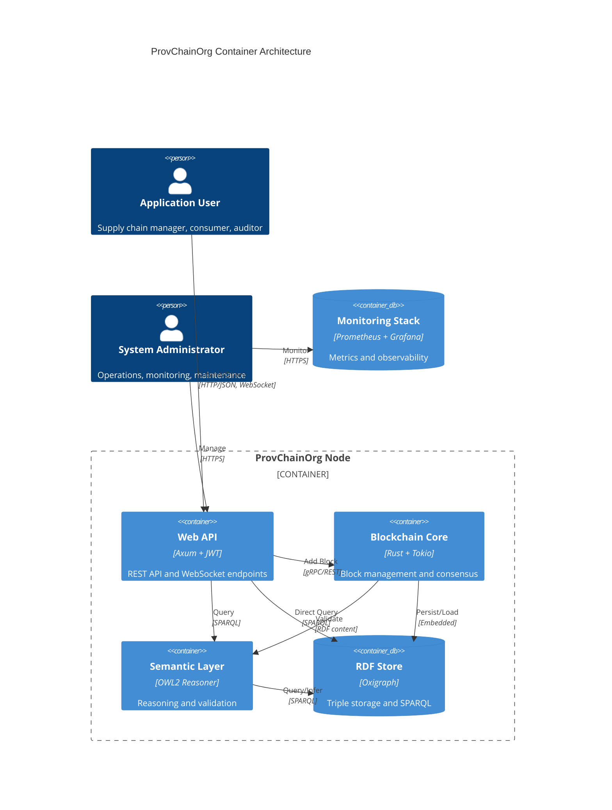
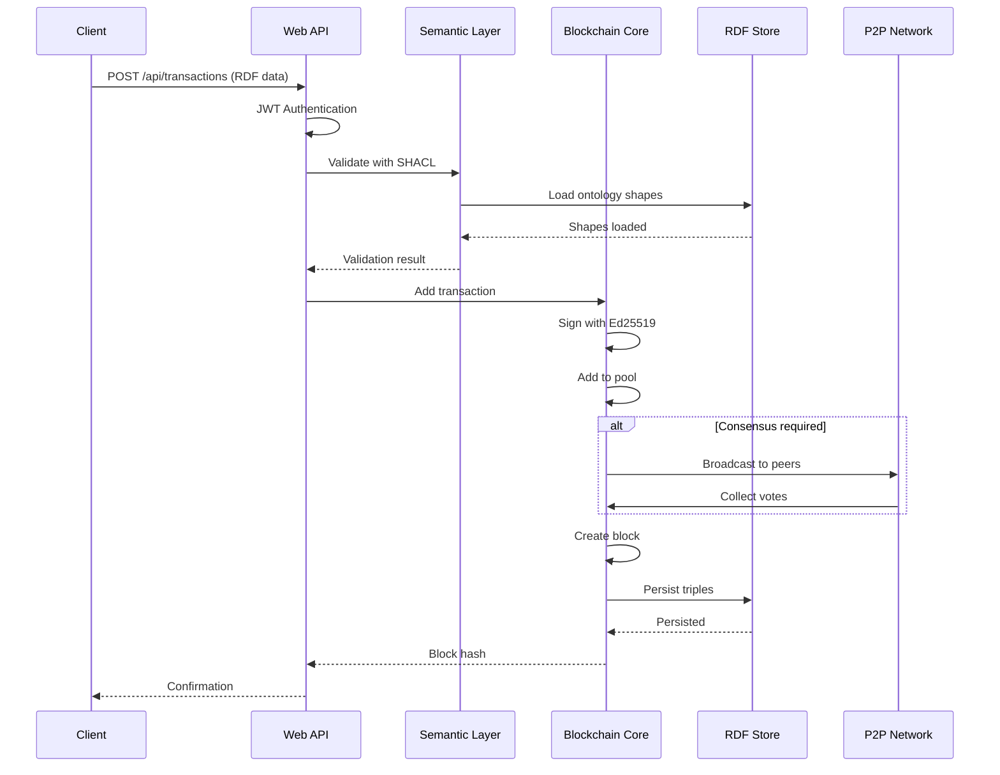
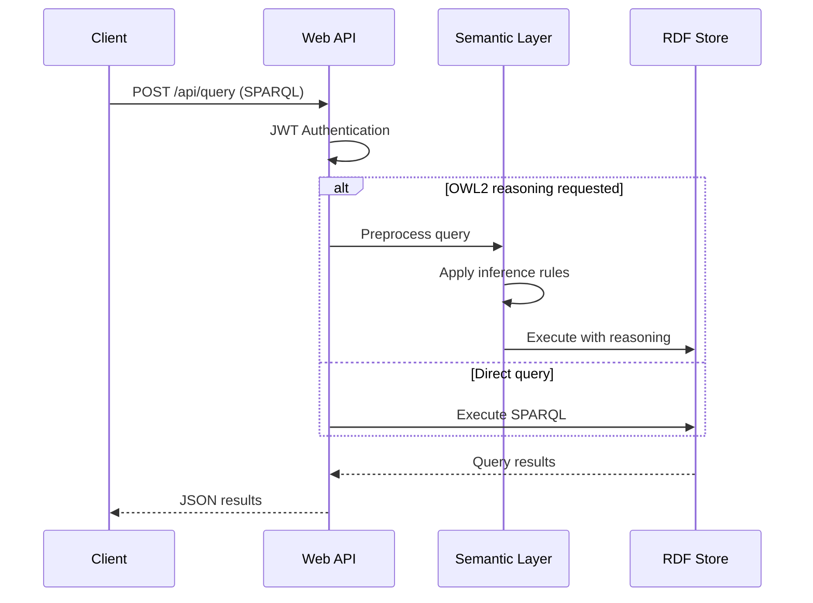
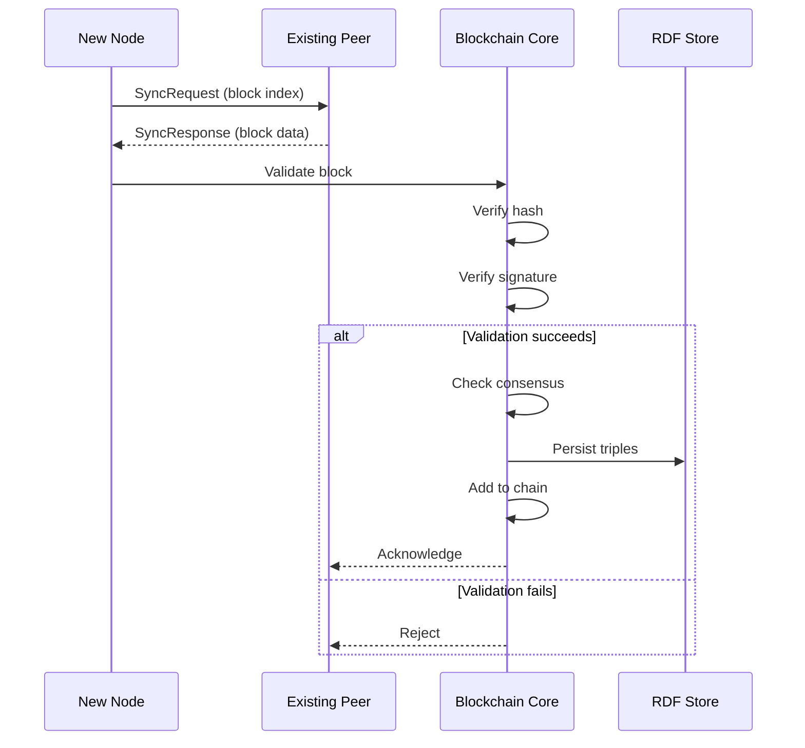

# ProvChainOrg Container Architecture Documentation

## C4 Model: Level 2 - Container Architecture

**Version:** 1.0
**Last Updated:** 2026-01-28
**Author:** Anusorn Chaikaew (Student Code: 640551018)
**Thesis:** Enhancement of Blockchain with Embedded Ontology and Knowledge Graph for Data Traceability

---

## 1. Container Overview

ProvChainOrg is organized as a set of interconnected containers that provide scalability, modularity, and isolation. Each container represents a deployable unit with specific responsibilities.

### 1.1 Container Definition

In this context, a **container** is:
- A deployable unit (Docker container or standalone process)
- An independently scalable service
- A logical boundary around related functionality
- A runtime isolation boundary

### 1.2 Container Inventory

| Container | Technology | Purpose | Scale |
|-----------|-----------|---------|-------|
| **Web API** | Axum + Tokio | REST API, WebSocket, JWT auth | Horizontal (multiple instances) |
| **Blockchain Core** | Rust + Tokio | Block management, consensus engine | Single instance per node |
| **Semantic Layer** | SPACL `owl2-reasoner` + Oxigraph | OWL2 reasoning, SHACL validation | Single instance per node |
| **RDF Store** | Oxigraph | Triple/quad storage, SPARQL queries | Single instance per node |
| **P2P Network** | WebSocket | Peer communication, block sync | Embedded in Blockchain Core |
| **Monitoring** | Prometheus + Grafana | Metrics, dashboards, tracing | Per cluster |

---

## 2. Container Context Diagram



---

## 3. Container Details

### 3.1 Web API Container

**Technology Stack:**
- Framework: Axum 0.7
- Authentication: JWT (jsonwebtoken crate)
- Async Runtime: Tokio
- WebSocket: tokio-tungstenite

**Responsibilities:**
- REST API endpoints for transaction submission
- SPARQL query interface
- WebSocket for real-time updates
- JWT authentication and authorization
- Request validation and routing
- Metrics export (Prometheus format)

**Interfaces:**
| Port | Protocol | Purpose |
|------|----------|---------|
| 8080 | HTTP | REST API |
| 8080 | WebSocket | P2P communication |
| 9090 | HTTP | Metrics endpoint |

**Dependencies:**
- Blockchain Core (for transaction submission)
- RDF Store (for queries)
- Semantic Layer (for validation)

**Scaling:**
- Horizontal scaling supported (stateless design)
- Load balancer distributes requests
- JWT shared via environment variable or secret store

**Configuration:**
```toml
[web]
host = "0.0.0.0"
port = 8080
jwt_secret = "${JWT_SECRET}"  # Required: 32+ characters
cors_origins = ["http://localhost:5173", "http://localhost:5174"]
```

---

### 3.2 Blockchain Core Container

**Technology Stack:**
- Language: Rust 1.70+
- Runtime: Tokio
- Cryptography: Ed25519 (ed25519-dalek)
- Consensus: PoA / PBFT (switchable)

**Responsibilities:**
- Block creation and validation
- Transaction pool management
- Consensus protocol execution
- Chain state management
- Block signature verification
- P2P message handling

**Key Components:**
- State Manager: Maintains blockchain state
- Consensus Engine: Executes PoA or PBFT
- Block Creator: Assembles new blocks
- Block Validator: Verifies hashes and signatures
- Transaction Pool: Holds pending transactions

**Data Structures:**
```rust
pub struct Blockchain {
    pub chain: Vec<Block>,
    pub rdf_store: Arc<RDFStore>,
    pub transaction_pool: TransactionPool,
    pub consensus: Box<dyn ConsensusProtocol>,
    pub signing_key: SigningKey,
}
```

**Interfaces:**
- gRPC/REST API for block operations
- P2P WebSocket for peer communication
- Embedded RDF store access

**Consensus Protocols:**
| Protocol | Use Case | Performance |
|----------|----------|-------------|
| **PoA** | Authority networks, private chains | Fastest (~1s block time) |
| **PBFT** | Public consortium, Byzantine fault tolerance | Slower (~3s block time) |

**Scaling:**
- Single instance per node (consensus requires identity)
- Vertical scaling for higher throughput
- Sharding considered for future scalability

---

### 3.3 Semantic Layer Container

**Technology Stack:**
- OWL2 Reasoner: `owl2-reasoner` from SPACL (git dependency)
- RDF Store: Oxigraph integration
- Validation: SHACL Shapes
- Query: SPARQL 1.1

**Responsibilities:**
- OWL2 consistency checking
- SHACL constraint validation
- Property chain inference
- Qualified cardinality reasoning
- Ontology management

**Key Capabilities:**
| Feature | Description | Performance |
|---------|-------------|-------------|
| **Tableaux Reasoning** | SROIQ(D) description logic | 15-169 µs |
| **Property Chains** | Transitive relationship inference | < 1ms |
| **hasKey Constraints** | Key-based uniqueness validation | < 1ms |
| **SHACL Validation** | Shape-based constraint checking | < 5ms |

**Integration Points:**
- Called by Blockchain Core during block validation
- Called by Web API for query enhancement
- Accesses RDF Store for ontology data

**Ontology Support:**
- Turtle, RDF/XML, N-Triples, OWL/Functional
- Domain-specific ontologies (UHT manufacturing, automotive, pharmaceutical, healthcare)
- Custom ontology loading via `--ontology` parameter

---

### 3.4 RDF Store Container

**Technology Stack:**
- Storage Engine: Oxigraph
- Query Language: SPARQL 1.1
- Storage Format: RDF N-Quads (named graphs)

**Responsibilities:**
- Triple/quad storage and retrieval
- SPARQL query execution
- Named graph management
- Persistent storage to disk
- Index management (B-Tree, hash indexes)

**Data Organization:**
```
Graph Naming Convention:
- http://provchain.org/block/{index}  → Block data
- http://provchain.org/ontology/{name} → Ontology definitions
- http://provchain.org/shacl/{name}   → SHACL shapes
```

**Performance Characteristics:**
| Operation | Performance | Notes |
|-----------|-------------|-------|
| **Insert Triple** | < 1ms | Bulk operations supported |
| **SPARQL SELECT** | 35 µs - 18 ms | Scales with dataset size |
| **SPARQL CONSTRUCT** | < 5ms | Graph query performance |
| **Graph Load** | < 100ms | For 1000-triple graphs |

**Storage Configuration:**
```toml
[storage]
data_dir = "./data/provchain"
persistent = true
cache_size = "1GB"
```

---

### 3.5 P2P Network Container

**Technology Stack:**
- Protocol: WebSocket (tokio-tungstenite)
- Serialization: JSON (MessagePack considered for v2)
- Discovery: Static peer list (mDNS for future)

**Responsibilities:**
- Peer discovery and connection management
- Block propagation
- Transaction gossip
- Consensus voting
- Chain synchronization

**Message Types:**
| Message | Purpose | Frequency |
|---------|---------|-----------|
| **NewBlock** | Propagate newly created block | On block creation |
| **NewTransaction** | Gossip pending transactions | Continuous |
| **Vote** | Consensus voting (PBFT) | During consensus |
| **SyncRequest** | Request chain state | On boot, when behind |
| **SyncResponse** | Return chain state | In response to SyncRequest |

**Peer Management:**
- Maximum peers: 8 (configurable)
- Connection timeout: 30 seconds
- Heartbeat interval: 10 seconds

---

### 3.6 Monitoring Stack Container

**Technology Stack:**
- Metrics: Prometheus 2.x
- Visualization: Grafana 9.x
- Tracing: Jaeger (optional)
- Logging: Structured JSON (tracing crate)

**Responsibilities:**
- Metrics collection and storage
- Dashboard visualization
- Alert generation
- Distributed tracing
- Log aggregation

**Key Metrics:**
| Metric | Type | Description |
|--------|------|-------------|
| **provchain_transactions_total** | Counter | Total transactions processed |
| **provchain_blocks_created** | Counter | Total blocks created |
| **provchain_spq_query_duration** | Histogram | SPARQL query latency |
| **provchain_consensus_duration** | Histogram | Consensus round duration |
| **provchain_peer_count** | Gauge | Active peer connections |

**Dashboards:**
- Blockchain Overview (blocks, transactions, peers)
- Performance (latency, throughput)
- Semantic Layer (reasoning time, validation)
- System Health (memory, CPU, disk)

---

## 4. Container Interactions

### 4.1 Transaction Submission Flow



**Key Decision Points:**
1. **SHACL Validation**: Fails fast if data violates constraints
2. **Transaction Pool**: Holds transactions until consensus
3. **Block Creation**: Batched by time (1s) or size limit
4. **Persistence**: RDF triples stored before block commit

---

### 4.2 SPARQL Query Flow



**Query Optimization:**
- Query pattern caching
- Index selection (B-Tree for predicates, hash for subjects)
- Result set streaming for large queries

---

### 4.3 Block Synchronization Flow



**Sync Strategies:**
1. **Full Sync**: Request all blocks from genesis
2. **Header Sync**: Request block headers first, then bodies
3. **State Sync**: Request current state, then recent blocks

---

## 5. Technology Rationale

### 5.1 Why Axum for Web API?

**Decision Criteria:**
- Async performance
- Type safety
- Ecosystem integration

**Alternatives Considered:**
| Framework | Pros | Cons | Decision |
|-----------|------|------|----------|
| **Axum** | Tower ecosystem, type-safe routing, async-first | Smaller ecosystem | ✅ Chosen |
| Actix-web | Mature, large ecosystem | Macro-heavy, runtime reflection | ❌ Rejected |
| Rocket | Simple API, type-safe | Sync-only, limited flexibility | ❌ Rejected |

**Rationale:**
- Tower middleware ecosystem (JWT, CORS, tracing)
- Compile-time route validation
- Extractor pattern for type-safe handlers
- Future-proof with async/await

---

### 5.2 Why Oxigraph for RDF Store?

**Decision Criteria:**
- SPARQL 1.1 compliance
- Rust integration
- Performance

**Alternatives Considered:**
| Store | Pros | Cons | Decision |
|-------|------|------|----------|
| **Oxigraph** | Pure Rust, fast, SPARQL 1.1 | Smaller community | ✅ Chosen |
| Jena (via FFI) | Mature, full feature set | JVM overhead, FFI complexity | ❌ Rejected |
| Blazegraph | High performance | Java-based, maintenance lag | ❌ Rejected |

**Rationale:**
- Native Rust integration (no FFI overhead)
- SPARQL 1.1 query support
- Excellent performance (microsecond-range queries)
- Active maintenance

---

### 5.3 Why WebSocket for P2P?

**Decision Criteria:**
- Bidirectional communication
- Low overhead
- Firewall compatibility

**Alternatives Considered:**
| Protocol | Pros | Cons | Decision |
|----------|------|------|----------|
| **WebSocket** | Bidirectional, low latency | Requires proxy support | ✅ Chosen |
| HTTP/2 | Stream multiplexing | Unidirectional (server→client) | ❌ Rejected |
| gRPC | High performance | Complex NAT traversal | ❌ Rejected |
| libp2p | Full P2P stack | Complexity overkill | ❌ Rejected |

**Rationale:**
- Bidirectional (block propagation + voting)
- Low overhead (binary framing)
- Browser-compatible (future web UI)
- Simple to implement and debug

---

### 5.4 Why Prometheus for Monitoring?

**Decision Criteria:**
- Cloud-native standard
- Pull-based metrics
- Ecosystem integration

**Alternatives Considered:**
| System | Pros | Cons | Decision |
|---------|------|------|----------|
| **Prometheus** | Standard, pull-based, long-term storage | Not push-based | ✅ Chosen |
| InfluxDB | Push-based, time-series optimized | Less standard | ❌ Rejected |
| Datadog | Full-featured | Cost, vendor lock-in | ❌ Rejected |

**Rationale:**
- Cloud-native standard (CNCF)
- Pull-based (no push complexity)
- Grafana integration
- AlertManager for notifications

---

## 6. Deployment Architecture

### 6.1 Single-Node Deployment

**Use Case:** Development, testing, small deployments

```
┌─────────────────────────────────────────┐
│         ProvChainOrg Node               │
│  ┌───────────────────────────────────┐  │
│  │  Docker Compose                   │  │
│  │  ┌─────────────────────────────┐  │  │
│  │  │ Web API (port 8080)         │  │  │
│  │  ├─────────────────────────────┤  │  │
│  │  │ Blockchain Core             │  │  │
│  │  ├─────────────────────────────┤  │  │
│  │  │ Semantic Layer              │  │  │
│  │  ├─────────────────────────────┤  │  │
│  │  │ RDF Store                   │  │  │
│  │  ├─────────────────────────────┤  │  │
│  │  │ Monitoring (port 9090)      │  │  │
│  │  └─────────────────────────────┘  │  │
│  └───────────────────────────────────┘  │
└─────────────────────────────────────────┘
```

**Configuration:** `deploy/docker-compose.yml`

---

### 6.2 Multi-Node Cluster Deployment

**Use Case:** Production, consortium networks

```
┌──────────────┐      ┌──────────────┐      ┌──────────────┐
│   Node 1     │      │   Node 2     │      │   Node 3     │
│ ┌──────────┐ │      │ ┌──────────┐ │      │ ┌──────────┐ │
│ │ Web API  │ │      │ │ Web API  │ │      │ │ Web API  │ │
│ ├──────────┤ │      │ ├──────────┤ │      │ ├──────────┤ │
│ │Blockchain│◄┼─────┼►│Blockchain│◄┼─────┼►│Blockchain│ │
│ ├──────────┤ │      │ ├──────────┤ │      │ ├──────────┤ │
│ │Semantic  │ │      │ │Semantic  │ │      │ │Semantic  │ │
│ ├──────────┤ │      │ ├──────────┤ │      │ ├──────────┤ │
│ │ RDF Store│ │      │ │ RDF Store│ │      │ │ RDF Store│ │
│ └──────────┘ │      │ └──────────┘ │      │ └──────────┘ │
└──────────────┘      └──────────────┘      └──────────────┘
       │                     │                     │
       └─────────────────────┴─────────────────────┘
                    P2P Network (WebSocket)
```

**Configuration:** `deploy/docker-compose.3node.yml`

**Network Topology:**
- Mesh network (all-to-all peer connections)
- Minimum 3 nodes for PBFT fault tolerance
- Recommended 5+ nodes for production

---

## 7. Cross-Cutting Concerns

### 7.1 Security

| Layer | Mechanism | Purpose |
|-------|-----------|---------|
| **Transport** | TLS 1.3 | Encrypt P2P communication |
| **Application** | JWT | Authenticate API requests |
| **Data** | ChaCha20-Poly1305 | Encrypt private triples |
| **Blockchain** | Ed25519 | Sign blocks and transactions |

**Security Boundaries:**
- Public data: Accessible via SPARQL
- Private data: Encrypted, owner-controlled
- Admin operations: JWT with admin role

### 7.2 Observability

**Metrics Collection:**
- Web API: Request count, latency, error rate
- Blockchain: Block creation rate, consensus duration
- Semantic Layer: Reasoning time, validation results
- RDF Store: Query performance, storage size

**Logging:**
- Structured JSON logs
- Log levels: ERROR, WARN, INFO, DEBUG, TRACE
- Distributed tracing with Jaeger (optional)

### 7.3 Configuration Management

**Environment Variables:**
```bash
# Required
JWT_SECRET=32-character-minimum-secret-key

# Optional
PROVCHAIN_PORT=8080
PROVCHAIN_PEERS=ws://peer1:8080,ws://peer2:8080
PROVCHAIN_CONSENSUS=poa  # or pbft
PROVCHAIN_DATA_DIR=./data/provchain
```

**Configuration Files:**
- `config/config.toml` - Main configuration
- `config/ontology.toml` - Ontology settings
- `config/production.toml` - Production deployment

---

## 8. Related Documentation

### C4 Model
- [System Context](./SYSTEM_CONTEXT.md) - C4 Level 1
- [Component Architecture](./COMPONENT_ARCHITECTURE.md) - C4 Level 3 (planned)

### Supporting
- [Deployment Guide](../deployment/HANDS_ON_DEPLOYMENT_GUIDE.md)
- [Security Architecture](./SECURITY_ARCHITECTURE.md) (planned)
- [Integration Architecture](./INTEGRATION_ARCHITECTURE.md) (planned)

### ADRs
- [ADR 0001: Use Rust](./ADR/0001-use-rust-for-blockchain-core.md)
- [ADR 0002: Use Oxigraph](./ADR/0002-use-oxigraph-rdf-store.md)
- [ADR 0006: Dual Consensus](./ADR/0006-dual-consensus-protocol.md) (planned)

---

**Contact:** Anusorn Chaikaew (Student Code: 640551018)
**Thesis Advisor:** Associate Professor Dr. Ekkarat Boonchieng
**Department:** Computer Science, Faculty of Science, Chiang Mai University
