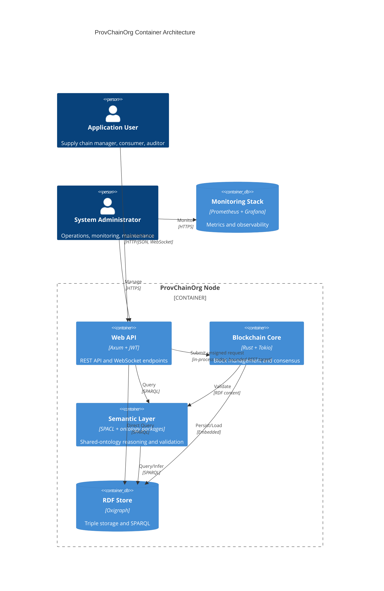
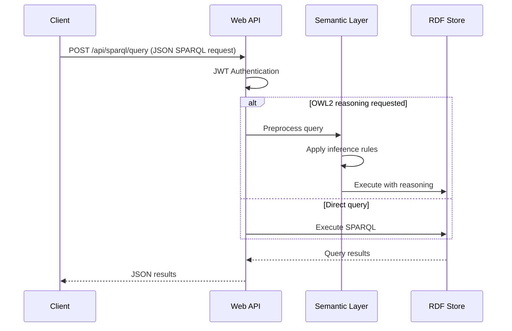

# ProvChainOrg Target/Reference Container Architecture

## C4 Model: Level 2 - Target Container Architecture

**Version:** 1.1
**Last Updated:** 2026-08-31
**Author:** Anusorn Chaikaew (Student Code: 640551018)
**Thesis:** Enhancement of Blockchain with Embedded Ontology and Knowledge Graph for Data Traceability

> **Scope and evidence boundary (2026-08-31):** this is the accepted target/reference container
> architecture, not a description of an operational deployment. Unless a paragraph explicitly says
> that a behavior is implemented and cites reproduced evidence, topology, interface, scaling,
> transport-security, semantic-enforcement, synchronization, and deployment statements below are
> requirements or planning inventory. In particular, horizontal REST scaling, any gRPC boundary,
> activated TLS 1.3, PBFT selection, exact three-node replication/convergence, and complete
> package-declared semantic Final Admission remain pending. The normative write contract is one
> complete-envelope Final Admission followed by the Ledger Journal append plus `fsync` as the sole
> commit point; the in-memory chain, Oxigraph, and indexes are rebuildable projections.

---

## 1. Container Overview

The target ProvChainOrg architecture separates responsibilities into the logical containers below.
The boundaries support modular reasoning and future deployment isolation; they do not by themselves
prove independent deployability, horizontal scalability, or operational isolation.

### 1.1 Container Definition

In this context, a **container** is:
- A target deployable unit (Docker container or standalone process)
- A logical scaling boundary whose safe independent scaling must still be demonstrated
- A logical boundary around related functionality
- A target runtime isolation boundary

### 1.2 Container Inventory

| Container | Technology | Purpose | Scale |
|-----------|-----------|---------|-------|
| **Web API** | Axum + Tokio | REST API, WebSocket, JWT auth | Target horizontal ingress; safety/evidence pending |
| **Blockchain Core** | Rust + Tokio | Block management, consensus engine | Single instance per node |
| **Semantic Layer** | SPACL `owl2-reasoner` + Oxigraph | Shared-ontology reasoning and validation | Single instance per node |
| **RDF Store** | Oxigraph | Triple/quad storage, SPARQL queries | Single instance per node |
| **P2P Network** | WebSocket | Peer communication, block sync | Embedded in Blockchain Core |
| **Monitoring** | Prometheus + Grafana | Metrics, dashboards, tracing | Per cluster |

---

## 2. Container Context Diagram


```mermaid
C4Container
    title ProvChainOrg Container Architecture

    Person(user, "Application User", "Supply chain manager, consumer, auditor")
    Person(admin, "System Administrator", "Operations, monitoring, maintenance")

    Container_Boundary(provchain, "ProvChainOrg Node") {
        Container(web_api, "Web API", "Axum + JWT", "REST API and WebSocket endpoints")
        Container(blockchain, "Blockchain Core", "Rust + Tokio", "Block management and consensus")
        Container(semantic, "Semantic Layer", "SPACL + ontology packages", "Shared-ontology reasoning and validation")
        ContainerDb(rdf_store, "RDF Store", "Oxigraph", "Triple storage and SPARQL")
    }

    ContainerDb(monitoring, "Monitoring Stack", "Prometheus + Grafana", "Metrics and observability")

    Rel(user, web_api, "Submit/Query", "HTTP/JSON, WebSocket")
    Rel(admin, web_api, "Manage", "HTTPS")
    Rel(admin, monitoring, "Monitor", "HTTPS")

    Rel(web_api, blockchain, "Submit unsigned request", "in-process today; bounded REST target")
    Rel(web_api, semantic, "Query", "SPARQL")
    Rel(web_api, rdf_store, "Direct Query", "SPARQL")

    Rel(blockchain, rdf_store, "Persist/Load", "Embedded")
    Rel(blockchain, semantic, "Validate", "RDF content")
    Rel(semantic, rdf_store, "Query/Infer", "SPARQL")
```

---

## 3. Container Details

### 3.1 Web API Container

**Technology Stack:**
- Framework: Axum 0.7
- Authentication: JWT (jsonwebtoken crate)
- Async Runtime: Tokio
- WebSocket: tokio-tungstenite

**Responsibilities:**
- REST API endpoints for RDF dataset/block admission
- SPARQL query interface
- WebSocket for real-time updates
- JWT authentication and authorization
- Request validation and routing
- Metrics export (Prometheus format)

**Interfaces:**
| Port | Protocol | Purpose |
|------|----------|---------|
| 8080 | HTTP | REST API |
| 8080 | WebSocket | P2P communication |
| 9090 | HTTP | Metrics endpoint |

**Dependencies:**
- Blockchain Core (for RDF block admission)
- RDF Store (for queries)
- Semantic Layer (for validation)

**Scaling:**
- Horizontal REST ingress is a target, not a validated current capability.
- A load balancer may distribute read-only or preflight work only after implementation proves that
  every write still enters the one per-ledger Proposal Coordinator and Final Admission boundary.
- No Web API replica may own an independent signer, journal authority, replay set, or mutable ledger
  state. JWT-secret distribution does not make ledger writes stateless or safe to scale.

**Configuration:**
```toml
[web]
host = "0.0.0.0"
port = 8080
jwt_secret = "${JWT_SECRET}"  # Required: 32+ characters
cors_origins = ["http://localhost:5173", "http://localhost:5174"]
```

---

### 3.2 Blockchain Core Container

**Technology Stack:**
- Language: Rust 1.87+
- Runtime: Tokio
- Cryptography: Ed25519 (ed25519-dalek)
- Consensus: PoA reference implementation candidate with three-node evidence pending; PBFT experimental opt-in

**Responsibilities:**
- Block creation and validation
- RDF block proposal and admission
- Consensus protocol integration
- Chain state management
- Block signature verification
- P2P message handling

**Key Components:**
- State Manager: Maintains blockchain state
- Consensus Engine: Contains the PoA reference candidate and an experimental PBFT skeleton; neither
  code presence nor opt-in is convergence/finality evidence
- Block Creator: Assembles new blocks
- Block Validator: Verifies hashes and signatures
- Persistent Storage Adapter: Persists admitted blocks when enabled

**Data Structures:**
```rust
pub struct Blockchain {
    pub chain: Vec<Block>,
    pub rdf_store: RDFStore,
    pub ontology_manager: Option<OntologyManager>,
    pub shacl_validator: Option<ShaclValidator>,
    pub governance: Governance,
    pub signing_key: SigningKey,
    pub validator_public_key: String,
    persistent_storage: Option<Arc<Mutex<PersistentStorage>>>,
}
```

**Interfaces:**
- Current in-process adapters and REST-facing handlers for block operations
- A gRPC container boundary is not implemented or activated; any future gRPC/REST split must retain
  the same bounded request, authentication, coordinator, Final Admission, and journal authority
- P2P WebSocket for peer communication
- Embedded RDF store access

**Consensus Protocols:**
| Protocol | Use Case | Performance |
|----------|----------|-------------|
| **PoA** | Authority networks, private chains | Reference path; exact three-node convergence/recovery evidence pending |
| **PBFT** | Controlled research/experimental Byzantine-fault-tolerance work | Experimental opt-in; not production-claimed |

**Scaling:**
- Single instance per node (consensus requires identity)
- Vertical scaling for higher throughput
- Sharding considered for future scalability

---

### 3.3 Semantic Layer Container

> **Activation boundary:** current ontology/SPACL components and focused benchmarks are partial
> implementation evidence only. Mandatory package selection, full staged-union SHACL, Candidate
> Focus, deterministic bounds, and identical enforcement on local, follower, catch-up, privacy, and
> bridge writes are target Final Admission requirements and remain pending end-to-end evidence.

**Technology Stack:**
- OWL2 Reasoner: `owl2-reasoner` from SPACL (git dependency)
- RDF Store: Oxigraph integration
- Validation: SHACL Shapes
- Query: SPARQL 1.1

**Responsibilities:**
- ontology-package loading and compatibility checks
- SHACL constraint validation
- SPACL-backed reasoning
- current partial startup/discovery ontology-package hash checks; not complete admission enforcement
- ontology management for permissioned traceability workflows

**Key Capabilities:**
| Feature | Description | Performance |
|---------|-------------|-------------|
| **Tableaux Reasoning** | SROIQ(D) description logic through SPACL-backed paths | Evidence-scoped; see benchmark docs |
| **Property Chains** | Transitive relationship inference | Evidence-scoped; see benchmark docs |
| **hasKey Constraints** | Key-based uniqueness validation | Evidence-scoped; see benchmark docs |
| **SHACL Validation** | Shape-based constraint checking | Evidence-scoped; see benchmark docs |

**Integration Points:**
- called by Blockchain Core during block validation
- called by Web API for query enhancement
- accesses RDF Store for ontology data
- target Final Admission enforces the shared semantic contract; current direct integration points
  are partial and do not prove every ingress path

**Ontology Support:**
- Turtle, RDF/XML, N-Triples, OWL/Functional
- shared ontology packages for general traceability networks
- reference ontology-package demos for UHT, automotive, pharmaceutical, and healthcare
- custom ontology loading via `--ontology` parameter

---

### 3.4 RDF Store Container

**Technology Stack:**
- Storage Engine: Oxigraph
- Query Language: SPARQL 1.1
- Storage Format: RDF N-Quads (named graphs)

**Responsibilities:**
- Triple/quad storage and retrieval
- SPARQL query execution
- Named graph management
- Persistent storage to disk
- Index management (B-Tree, hash indexes)

**Data Organization:**
```
Graph Naming Convention:
- http://provchain.org/block/{index}  → Block data
- http://provchain.org/ontology/{name} → Ontology definitions
- http://provchain.org/shacl/{name}   → SHACL shapes
```

**Performance Characteristics:**
| Operation | Performance | Notes |
|-----------|-------------|-------|
| **Insert Triple** | Evidence-scoped | Use current benchmark artifacts before citing latency |
| **SPARQL SELECT** | Evidence-scoped | Scales with dataset size and query shape |
| **SPARQL CONSTRUCT** | Evidence-scoped | Graph-query performance depends on workload |
| **Graph Load** | Evidence-scoped | Depends on graph size and persistence mode |

**Storage Configuration:**
```toml
[storage]
data_dir = "./data/provchain"
persistent = true
cache_size = "1GB"
```

---

### 3.5 P2P Network Container

**Technology Stack:**
- Protocol: WebSocket (tokio-tungstenite)
- Serialization: JSON (MessagePack considered for v2)
- Discovery: Static peer list (mDNS for future)

**Responsibilities:**
- Peer discovery and connection management
- Block propagation
- RDF block proposal propagation
- Consensus voting/attestation according to the active profile
- Chain synchronization

**Message Types:**
| Message | Purpose | Frequency |
|---------|---------|-----------|
| **NewBlock** | Propagate newly created block | On block creation |
| **BlockProposal** | Propagate candidate RDF block data when enabled | During block admission |
| **Vote** | Legacy/experimental attestation message shape; not a validated PBFT path | Future controlled evidence only |
| **SyncRequest** | Request chain state | On boot, when behind |
| **SyncResponse** | Return chain state | In response to SyncRequest |

**Peer Management:**
- Maximum peers: 8 (configurable)
- Connection timeout: 30 seconds
- Heartbeat interval: 10 seconds

---

### 3.6 Monitoring Stack Container

**Technology Stack:**
- Metrics: Prometheus 2.x
- Visualization: Grafana 9.x
- Tracing: Jaeger (optional)
- Logging: Structured JSON (tracing crate)

**Responsibilities:**
- Metrics collection and storage
- Dashboard visualization
- Alert generation
- Distributed tracing
- Log aggregation

**Key Metrics:**
| Metric | Type | Description |
|--------|------|-------------|
| **provchain_transactions_total** | Counter | Total legacy transaction/RDF write records processed |
| **provchain_blocks_created** | Counter | Total blocks created |
| **provchain_spq_query_duration** | Histogram | SPARQL query latency |
| **provchain_consensus_duration** | Histogram | Consensus round duration |
| **provchain_peer_count** | Gauge | Active peer connections |

**Dashboards:**
- Blockchain Overview (blocks, RDF writes, peers)
- Performance (latency, throughput)
- Semantic Layer (reasoning time, validation)
- System Health (memory, CPU, disk)

---

## 4. Container Interactions

The sequences in this section are normative target/reference flows. They are not claims that the
current runtime already implements complete-envelope admission, durable replication, or recovery.

### 4.1 RDF Block Admission Flow

This diagram is the accepted thesis-reference target from ADRs 0016-0026; implementation and
end-to-end evidence remain pending. The current Web/API and blockchain helpers must not be read as
already implementing this boundary.

```mermaid
sequenceDiagram
    participant Client
    participant Adapter as Web/API Adapter
    participant Coordinator as PoA Proposal Coordinator
    participant Authority as Scheduled Authority
    participant Admission as Final Admission
    participant Journal as Ledger Journal
    participant Projection as In-memory/Oxigraph/Indexes
    participant Peer as Authenticated Peers

    Client->>Adapter: POST /api/datasets/import-turtle (RDF data)
    Adapter->>Adapter: Authenticate and validate bounded request syntax
    Adapter->>Coordinator: Unsigned ordinary-provenance request
    Coordinator->>Coordinator: Serialize/coalesce + read-only complete preflight
    Coordinator->>Coordinator: Select and durably fence one exact proposal body
    Coordinator->>Authority: Exact fenced body for current PoA Turn
    Authority-->>Admission: Exact signed Block Proposal
    Admission->>Admission: Verify parent/profile/manifest/turn/signature
    Admission->>Admission: Parse RDF + stage full committed union
    Admission->>Admission: Enforce package-declared SHACL/focus/bounds
    Admission->>Admission: Verify Post-State Commitment + complete envelope
    alt Every gate passes
        Admission->>Journal: Append complete Admitted Block Envelope + fsync
        Journal-->>Admission: Committed
        Journal->>Projection: Rebuild/update derived projections
        Journal->>Peer: Replicate exact committed envelope + prefix
        Admission-->>Adapter: Committed reference
        Adapter-->>Client: Confirmation
    else Any deterministic gate fails
        Admission-->>Adapter: Rejected; no journal or projection mutation
        Adapter-->>Client: Bounded rejection
    end
```

**Key Decision Points:**
1. **Adapter/preflight:** Read-only checks may reject early but cannot commit or mutate authority.
2. **Consensus acceptance:** Only the Scheduled Authority may sign the fenced proposal for the PoA
   Turn; a signature is eligible evidence, not commitment.
3. **Final Admission:** One universal boundary verifies integrity, membership, state commitments,
   and the active package's complete staged-union SHACL contract.
4. **Commit:** One append of the complete Admitted Block Envelope plus `fsync` is the sole commit
   point.
5. **Projection:** In-memory chain, Oxigraph, and indexes update only after commit and are
   rebuildable from Verified Journal Replay.

---

### 4.2 SPARQL Query Flow


```mermaid
sequenceDiagram
    participant Client
    participant WebAPI as Web API
    participant Semantic as Semantic Layer
    participant RDFStore as RDF Store

    Client->>WebAPI: POST /api/sparql/query (JSON SPARQL request)
    WebAPI->>WebAPI: JWT Authentication

    alt OWL2 reasoning requested
        WebAPI->>Semantic: Preprocess query
        Semantic->>Semantic: Apply inference rules
        Semantic->>RDFStore: Execute with reasoning
    else Direct query
        WebAPI->>RDFStore: Execute SPARQL
    end

    RDFStore-->>WebAPI: Query results
    WebAPI-->>Client: JSON results
```

**Query Optimization:**
- Query pattern caching
- Index selection (B-Tree for predicates, hash for subjects)
- Result set streaming for large queries

---

### 4.3 Block Synchronization Flow

This is the accepted exact-envelope catch-up target. Current bare-block/metadata synchronization is
nonconforming and does not establish three-node convergence.

This is the accepted exact-envelope convergence target from ADR 0023; the current P2P sync code and
legacy `three_node_validation_test.rs` do not constitute its evidence.

```mermaid
sequenceDiagram
    participant NewNode as New Node
    participant Peer as Authenticated Existing Peer
    participant Admission as Final Admission
    participant Journal as Ledger Journal
    participant Projection as In-memory/Oxigraph/Indexes

    NewNode->>Peer: Bounded range request from verified prefix checkpoint
    Peer-->>NewNode: Exact canonical envelopes + prefix evidence
    NewNode->>Admission: Next exact envelope in order
    Admission->>Admission: Verify parent/profile/manifest/PoA/signature
    Admission->>Admission: Recompute state/package/full-union SHACL commitments

    alt Validation succeeds
        Admission->>Journal: Append exact complete envelope + fsync
        Journal->>Projection: Rebuild/update derived projections
        NewNode-->>Peer: Signed Commit Receipt for envelope + prefix
    else Validation fails
        Admission-->>Peer: Reject; no journal/projection mutation
    end
```

**Sync Strategies:**
1. **Genesis-to-tip replay:** Verify and append every exact envelope in order.
2. **Bounded range catch-up:** Resume only from a verified local prefix checkpoint.
3. **No header/state shortcut:** Header-only or mutable state-snapshot trust is outside the current
   reference contract and cannot establish convergence.

---

## 5. Technology Rationale

### 5.1 Why Axum for Web API?

**Decision Criteria:**
- Async performance
- Type safety
- Ecosystem integration

**Alternatives Considered:**
| Framework | Pros | Cons | Decision |
|-----------|------|------|----------|
| **Axum** | Tower ecosystem, type-safe routing, async-first | Smaller ecosystem | ✅ Chosen |
| Actix-web | Mature, large ecosystem | Macro-heavy, runtime reflection | ❌ Rejected |
| Rocket | Simple API, type-safe | Sync-only, limited flexibility | ❌ Rejected |

**Rationale:**
- Tower middleware ecosystem (JWT, CORS, tracing)
- Compile-time route validation
- Extractor pattern for type-safe handlers
- Future-proof with async/await

---

### 5.2 Why Oxigraph for RDF Store?

**Decision Criteria:**
- SPARQL 1.1 compliance
- Rust integration
- Performance

**Alternatives Considered:**
| Store | Pros | Cons | Decision |
|-------|------|------|----------|
| **Oxigraph** | Pure Rust, fast, SPARQL 1.1 | Smaller community | ✅ Chosen |
| Jena (via FFI) | Mature, full feature set | JVM overhead, FFI complexity | ❌ Rejected |
| Blazegraph | High performance | Java-based, maintenance lag | ❌ Rejected |

**Rationale:**
- Native Rust integration (no FFI overhead)
- SPARQL 1.1 query support
- Excellent performance (microsecond-range queries)
- Active maintenance

---

### 5.3 Why WebSocket for P2P?

**Decision Criteria:**
- Bidirectional communication
- Low overhead
- Firewall compatibility

**Alternatives Considered:**
| Protocol | Pros | Cons | Decision |
|----------|------|------|----------|
| **WebSocket** | Bidirectional, low latency | Requires proxy support | ✅ Chosen |
| HTTP/2 | Stream multiplexing | Unidirectional (server→client) | ❌ Rejected |
| gRPC | High performance | Complex NAT traversal | ❌ Rejected |
| libp2p | Full P2P stack | Complexity overkill | ❌ Rejected |

**Rationale:**
- Bidirectional (block propagation + voting)
- Low overhead (binary framing)
- Browser-compatible (future web UI)
- Simple to implement and debug

---

### 5.4 Why Prometheus for Monitoring?

**Decision Criteria:**
- Cloud-native standard
- Pull-based metrics
- Ecosystem integration

**Alternatives Considered:**
| System | Pros | Cons | Decision |
|---------|------|------|----------|
| **Prometheus** | Standard, pull-based, long-term storage | Not push-based | ✅ Chosen |
| InfluxDB | Push-based, time-series optimized | Less standard | ❌ Rejected |
| Datadog | Full-featured | Cost, vendor lock-in | ❌ Rejected |

**Rationale:**
- Cloud-native standard (CNCF)
- Pull-based (no push complexity)
- Grafana integration
- AlertManager for notifications

---

## 6. Target Deployment Topology — Future Work, Not Operational Evidence

### 6.1 Single-Node Deployment

**Use Case:** Development and controlled testing; any operational small deployment is future work

```
┌─────────────────────────────────────────┐
│         ProvChainOrg Node               │
│  ┌───────────────────────────────────┐  │
│  │  Docker Compose                   │  │
│  │  ┌─────────────────────────────┐  │  │
│  │  │ Web API (port 8080)         │  │  │
│  │  ├─────────────────────────────┤  │  │
│  │  │ Blockchain Core             │  │  │
│  │  ├─────────────────────────────┤  │  │
│  │  │ Semantic Layer              │  │  │
│  │  ├─────────────────────────────┤  │  │
│  │  │ RDF Store                   │  │  │
│  │  ├─────────────────────────────┤  │  │
│  │  │ Monitoring (port 9090)      │  │  │
│  │  └─────────────────────────────┘  │  │
│  └───────────────────────────────────┘  │
└─────────────────────────────────────────┘
```

**Configuration:** `deploy/docker-compose.yml`

---

### 6.2 Multi-Node Cluster Deployment

**Use Case:** Future target/reference topology for consortium networks; not operational deployment
or pilot evidence

```
┌──────────────┐      ┌──────────────┐      ┌──────────────┐
│   Node 1     │      │   Node 2     │      │   Node 3     │
│ ┌──────────┐ │      │ ┌──────────┐ │      │ ┌──────────┐ │
│ │ Web API  │ │      │ │ Web API  │ │      │ │ Web API  │ │
│ ├──────────┤ │      │ ├──────────┤ │      │ ├──────────┤ │
│ │Blockchain│◄┼─────┼►│Blockchain│◄┼─────┼►│Blockchain│ │
│ ├──────────┤ │      │ ├──────────┤ │      │ ├──────────┤ │
│ │Semantic  │ │      │ │Semantic  │ │      │ │Semantic  │ │
│ ├──────────┤ │      │ ├──────────┤ │      │ ├──────────┤ │
│ │ RDF Store│ │      │ │ RDF Store│ │      │ │ RDF Store│ │
│ └──────────┘ │      │ └──────────┘ │      │ └──────────┘ │
└──────────────┘      └──────────────┘      └──────────────┘
       │                     │                     │
       └─────────────────────┴─────────────────────┘
                    P2P Network (WebSocket)
```

**Configuration:** `deploy/docker-compose.3node.yml`

**Network Topology:**
- Target mesh network (all-to-all authenticated peer sessions); implementation/evidence pending
- Three processes are the thesis-reference PoA evidence topology. PBFT is not required by that
  topology and remains a separate experimental/future protocol milestone.
- Controlled reference experiments use the PoA profile; no operational deployment claim is valid
  until its exact three-node convergence/recovery campaign passes. PBFT remains experimental.

---

## 7. Cross-Cutting Concerns

### 7.1 Security

| Layer | Mechanism | Purpose |
|-------|-----------|---------|
| **Transport** | Target TLS 1.3 | P2P transport encryption; activation/configuration/evidence pending |
| **Application** | JWT | Authenticate API requests |
| **Data** | ADR 0034 `ProtectedDataSuiteV1` | Accepted protected-payload contract; implementation inactive |
| **Participant client** | ADR 0035 `ParticipantKeyCustodyV1` + ADR 0036 `ParticipantKeystoreSuiteV1` | Durable client-only private-key custody and accepted whole-snapshot suite; implementation/evidence pending |
| **Blockchain** | Ed25519 | Sign blocks and validator assertions |

**Security Boundaries:**
- Public data: Accessible via SPARQL
- Protected data: One immutable ciphertext under a fresh per-object DEK; the accepted payload profile uses a one-use derived key, ChaCha20Poly1305, an all-zero 12-byte nonce, and raw `O` as associated data
- Live Privacy Release: Returns ciphertext, exactly one applicable DEK envelope, and prefix-bound evidence for client-side decryption; the server never decrypts
- Participant custody: Private keys and passphrases stay in a separate participant-side client under ADR 0036's bounded whole-snapshot commit/restore contract; node/server storage and backups never open or escrow them
- Admin operations: JWT with admin role; administration does not confer privacy authority

This `PrivacyControlV1` boundary is accepted architecture, not current implementation or profile
activation. See
[ADR 0034](./ADR/0034-pin-protected-data-suite-v1-and-canonical-privacy-encoding.md) and
[ADR 0035](./ADR/0035-keep-participant-private-keys-in-durable-client-only-custody.md).

### 7.2 Observability

**Metrics Collection:**
- Web API: Request count, latency, error rate
- Blockchain: Block creation rate, consensus duration
- Semantic Layer: Reasoning time, validation results
- RDF Store: Query performance, storage size

**Logging:**
- Structured JSON logs
- Log levels: ERROR, WARN, INFO, DEBUG, TRACE
- Distributed tracing with Jaeger (optional)

### 7.3 Configuration Management

**Environment Variables:**
```bash
# Required
JWT_SECRET=32-character-minimum-secret-key

# Optional
PROVCHAIN_PORT=8080
PROVCHAIN_PEERS=ws://peer1:8080,ws://peer2:8080
# Target/profile notation only; current environment-loader support is not asserted here.
PROVCHAIN_CONSENSUS=poa
# PBFT cannot be activated by changing this value alone. It remains experimental and requires the
# explicit allow_experimental_pbft gate plus a future validated profile/implementation/evidence path.
PROVCHAIN_DATA_DIR=./data/provchain
```

**Configuration Files:**
- `config/config.toml` - Main configuration
- `config/ontology.toml` - Ontology settings
- `config/production.toml` - Production-target template; not operational deployment evidence

---

## 8. Related Documentation

### C4 Model
- [System Context](./SYSTEM_CONTEXT.md) - C4 Level 1
- [Component Architecture](./COMPONENT_ARCHITECTURE.md) - C4 Level 3 (planned)

### Supporting
- [Local Execution Guide](../Run.md) (development/reference use only; operational deployment is future work)
- [Shared-Ontology Network Working Plan](./SHARED_ONTOLOGY_NETWORK_WORKING_PLAN.md) (current implementation order and evidence boundary)
- [Security Architecture](./SECURITY_ARCHITECTURE.md) (planned)
- [Integration Architecture](./INTEGRATION_ARCHITECTURE.md) (planned)

### ADRs
- [ADR 0001: Use Rust](./ADR/0001-use-rust-for-blockchain-core.md)
- [ADR 0002: Use Oxigraph](./ADR/0002-use-oxigraph-rdf-store.md)
- [ADR 0006: Dual Consensus](./ADR/0006-dual-consensus-protocol.md) (planned)

---

**Contact:** Anusorn Chaikaew (Student Code: 640551018)
**Thesis Advisor:** Associate Professor Dr. Ekkarat Boonchieng
**Department:** Computer Science, Faculty of Science, Chiang Mai University
