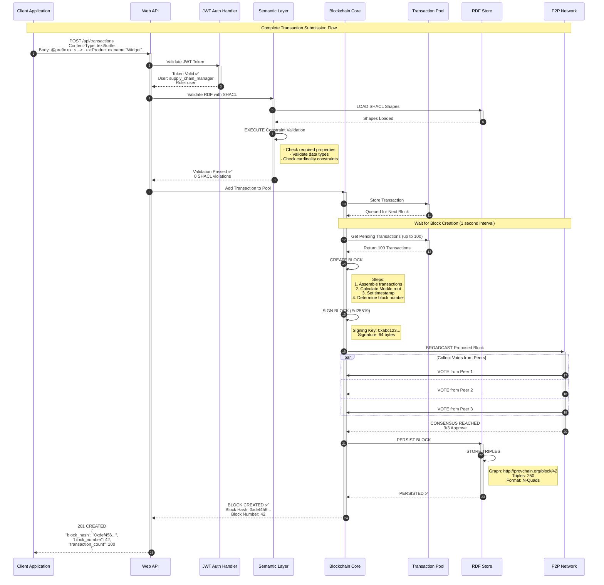
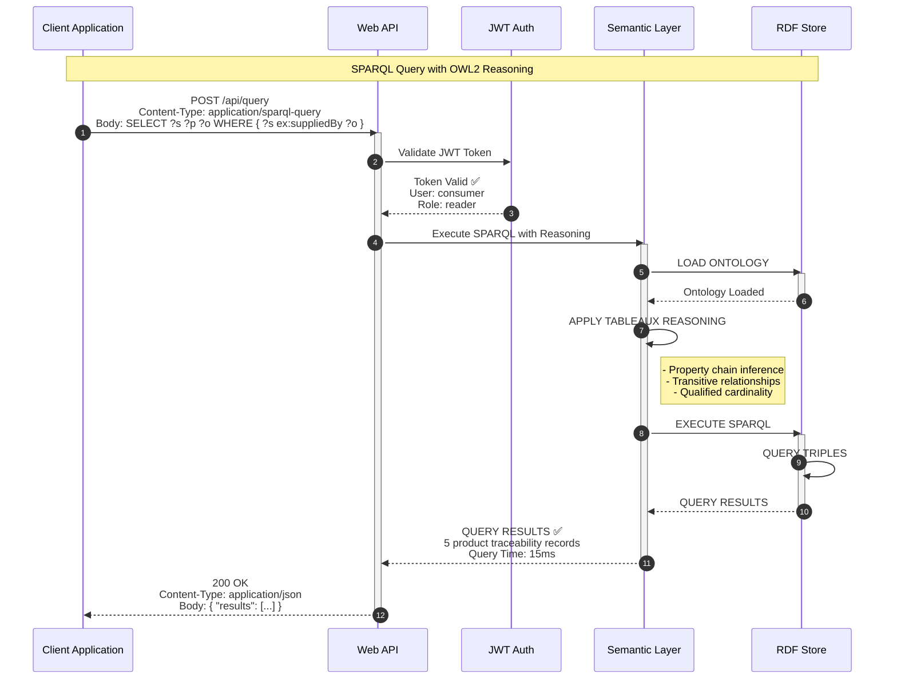
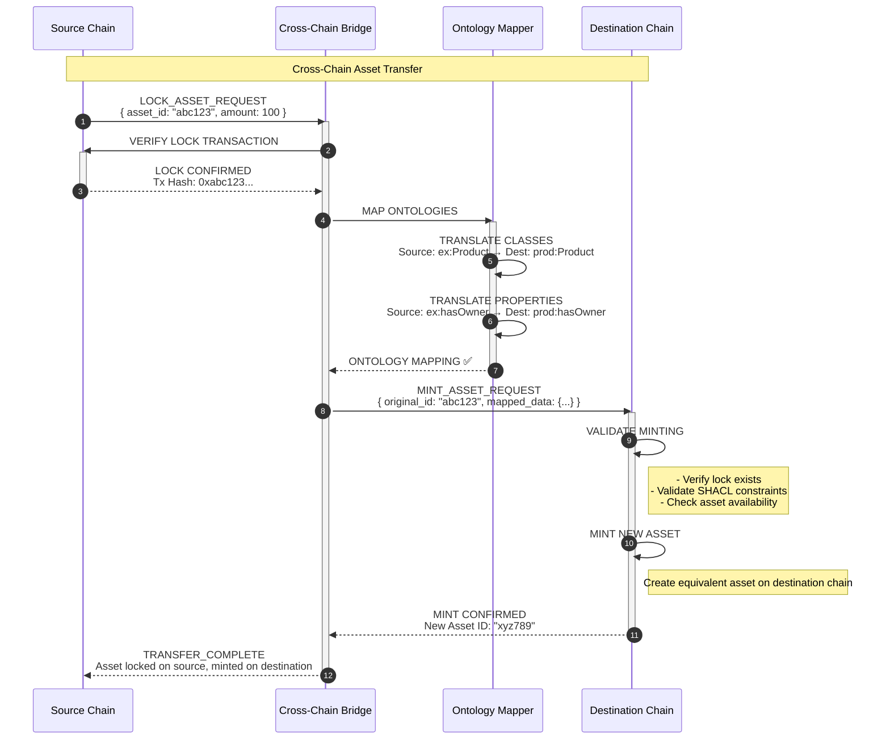

# ProvChainOrg Data Flow Architecture

**Version:** 1.0
**Last Updated:** 2026-01-28
**Author:** Anusorn Chaikaew (Student Code: 640551018)

---

## 1. Transaction Submission Flow

### 1.1 Overview

Transaction submission is the primary write operation in ProvChainOrg, where RDF data is submitted, validated, signed, and persisted to the blockchain.

### 1.2 Flow Diagram



### 1.3 Step-by-Step Breakdown

| Step | Component | Action | Duration |
|------|-----------|--------|----------|
| **1** | Client | Submit RDF data (Turtle format) | - |
| **2** | Web API | Extract JWT from Authorization header | < 1ms |
| **3** | JWT Auth | Verify signature and expiration | ~10 µs |
| **4** | Semantic Layer | Load SHACL shapes from RDF store | ~5 ms |
| **5** | Semantic Layer | Validate RDF against constraints | ~10 ms |
| **6** | Blockchain Core | Add transaction to pool | < 1ms |
| **7** | Blockchain Core | Wait for block interval (1s) | - |
| **8** | Blockchain Core | Fetch pending transactions (up to 100) | ~2 ms |
| **9** | Blockchain Core | Create block (assemble + sign) | ~5 ms |
| **10** | P2P Network | Broadcast to peers | ~10 ms |
| **11** | P2P Network | Collect votes (3/3 required) | ~100 ms |
| **12** | RDF Store | Persist block triples | ~50 ms |
| **13** | Web API | Return confirmation to client | - |

**Total Time:** ~200-300ms (client perspective, excluding wait time)

### 1.4 Error Handling

**Validation Failures:**
- **SHACL Violation:** Return 400 Bad Request with specific error
- **JWT Invalid:** Return 401 Unauthorized
- **Pool Full:** Return 503 Service Unavailable (retry later)

**Consensus Failures:**
- **Insufficient Votes:** Keep in pool, retry next interval
- **Peer Timeout:** Retry with different peer subset
- **Signature Invalid:** Reject block, don't persist

---

## 2. SPARQL Query Flow

### 2.1 Overview

SPARQL queries enable semantic reasoning and data retrieval from the blockchain, with optional OWL2 inference.

### 2.2 Flow Diagram



### 2.3 Step-by-Step Breakdown

| Step | Component | Action | Duration |
|------|-----------|--------|----------|
| **1** | Client | Submit SPARQL query | - |
| **2** | Web API | Extract and verify JWT | ~10 µs |
| **3** | Semantic Layer | Load ontology for reasoning | ~5 ms |
| **4** | Semantic Layer | Apply OWL2 reasoning | ~5 ms |
| **5** | RDF Store | Execute SPARQL query | ~15-35 ms |
| **6** | Semantic Layer | Format results (JSON) | ~1 ms |
| **7** | Web API | Return results to client | - |

**Total Time:** 25-60ms (depending on query complexity and dataset size)

### 2.4 Query Optimization

**Indexing Strategy:**
- **Subject Index:** Fast lookups by subject IRI
- **Predicate Index:** Fast lookups by property
- **Object Index:** Fast lookups by object value
- **Graph Index:** Fast filtering by named graph

**Query Caching:**
- LRU cache for common query patterns
- Cache size: 1,000 entries (configurable)
- TTL: 5 minutes (configurable)

---

## 3. Block Synchronization Flow

### 3.1 Overview

When a node joins the network or falls behind, it must synchronize its blockchain state with other peers.

### 3.2 Flow Diagram

```mermaid
sequenceDiagram
    autonumber
    participant NewNode as New Node
    participant Peer as Existing Peer
    participant Blockchain as Blockchain Core
    participant RDFStore as RDF Store
    participant P2P as P2P Network

    Note over NewNode,P2P: Node Synchronization Flow

    NewNode->>Peer: SYNC_REQUEST<br/>{ from_block: 40, to_block: 50 }
    activate Peer

    Peer->>Blockchain: Get Blocks 40-50
    activate Blockchain
    Blockchain->>RDFStore: Load Block Data
    RDFStore-->>Blockchain: Blocks Loaded
    Blockchain-->>Peer: 11 Blocks (40-50)
    deactivate Blockchain
    deactivate RDFStore

    Peer-->>NewNode: SYNC_RESPONSE<br/>{ blocks: [...], count: 11 }

    NewNode->>Blockchain: VALIDATE EACH BLOCK
    activate Blockchain

    loop For each block in response
        Blockchain->>Blockchain: VERIFY Hash
        Note right of Blockchain: SHA-256 of block header

        Blockchain->>Blockchain: VERIFY Signature
        Note right of Blockchain: Check Ed25519 signature

        Blockchain->>Blockchain: VERIFY PREV_HASH
        Note right of Blockchain: Check chain linkage

        Blockchain->>Blockchain: CHECK CONSENSUS
        Note right of Blockchain: Verify sufficient votes

        alt All Validations Pass
            Blockchain->>RDFStore: PERSIST BLOCK
            RDFStore-->>Blockchain: Persisted ✅
        else Validation Fails
            Blockchain-->>NewNode: REJECT BLOCK ❌
        end
    end

    deactivate Blockchain

    NewNode->>Peer: SYNC_ACK<br/>{ synced_to_block: 50 }
    deactivate Peer
```

### 3.3 Sync Strategies

| Strategy | Description | Use Case | Bandwidth |
|----------|-------------|----------|-----------|
| **Full Sync** | Request all blocks from genesis | New node bootstrapping | High |
| **Header Sync** | Request headers first, then bodies | Large chain, limited bandwidth | Medium |
| **State Sync** | Request current state, then recent blocks | Fast catch-up | Low |

---

## 4. Cross-Chain Bridge Flow

### 4.1 Overview

ProvChainOrg supports cross-chain data interchange with other blockchain systems using a Lock & Mint protocol.

### 4.2 Flow Diagram



### 4.3 Key Considerations

**Security:**
- Original asset must be locked (cannot be spent twice)
- Bridge verifies lock before minting
- Ontology mapping validated

**Consistency:**
- Atomic operation (all-or-nothing)
- Rollback mechanism if minting fails
- Eventual consistency across chains

**Performance:**
- Lock verification: ~100ms
- Ontology mapping: ~50ms
- Minting on destination: ~200ms
- **Total:** ~350ms per transfer

---

## 5. Real-Time Data Flow (IoT Integration)

### 5.1 Overview

IoT sensors submit real-time data (temperature, location) via WebSocket for continuous monitoring.

### 5.2 Flow Diagram

```mermaid
flowchart LR
    IoT["IoT Sensor<br/>Temperature/Humidity"] -->|"WebSocket<br/>JSON data"| WS["WebSocket Handler"]

    WS -->|"Parse & Validate"| Parser["Data Parser"]

    Parser -->|"Format as RDF"| Formatter["RDF Formatter"]

    Formatter -->|"Batch Collect"<br/>10 seconds or 100 readings| Batch["Batch Collector"]

    Batch -->|"Submit Transaction"| API["POST /api/transactions"]

    API -->|"Process"| Blockchain["Blockchain Core"]

    Blockchain -->|"Persist"| RDFStore["RDF Store"]
```



### 5.3 Data Format

**Incoming (WebSocket):**
```json
{
  "sensor_id": "temp_sensor_001",
  "timestamp": "2026-01-28T10:15:00Z",
  "temperature": 4.5,
  "humidity": 65,
  "location": "warehouse_a"
}
```

**Converted to RDF (Turtle):**
```turtle
@prefix iot: <http://provchain.org/iot/> .
@prefix xsd: <http://www.w3.org/2001/XMLSchema#> .

iot:temp_sensor_001
    iot:timestamp "2026-01-28T10:15:00Z"^^xsd:dateTime ;
    iot:temperature 4.5 ;
    iot:humidity 65 ;
    iot:location "warehouse_a" .
```

---

## 6. Performance Characteristics

| Flow Type | Latency (P95) | Throughput | Bottleneck |
|-----------|----------------|------------|------------|
| **Transaction Submission** | 200-300ms | 19.58 TPS (dev) | Consensus voting |
| **SPARQL Query** | 25-60ms | ~1000 QPS | RDF Store query |
| **Block Sync** | 500ms per 100 blocks | N/A | Network I/O |
| **Cross-Chain Transfer** | 350ms | ~1 TPS | Lock verification |

---

## 7. Error Handling & Recovery

### 7.1 Error Scenarios

| Error | Detection | Recovery | Impact |
|-------|----------|----------|--------|
| **SHACL Validation Failed** | Semantic Layer | Return 400 error | Transaction rejected |
| **JWT Expired** | JWT Handler | Return 401, request refresh | Client must re-auth |
| **Consensus Failed** | Blockchain Core | Retry next interval | Delayed block creation |
| **RDF Store Full** | RDF Store | Return 503, retry | Transaction rejected |
| **Peer Timeout** | P2P Layer | Try different peer | Delayed sync |

### 7.2 Retry Mechanisms

**Transaction Submission:**
- Immediate retry on connection failure
- Exponential backoff: 1s, 2s, 4s, 8s, 16s
- Max retries: 5 attempts

**SPARQL Query:**
- No retry for validation errors (client error)
- Retry on timeout: 3 attempts with 100ms timeout
- Cache results for identical queries

**Block Sync:**
- Retry indefinitely with exponential backoff
- Switch to different peer if current fails
- Rate limiting: 1 request per second

---

## 8. Related Documentation

### Internal
- [Container Architecture](./CONTAINER_ARCHITECTURE.md) - Container interactions
- [Component Architecture](./COMPONENT_ARCHITECTURE.md) - Component-level flows
- [Security Architecture](./SECURITY_ARCHITECTURE.md) - Secure data flow

### External
- [ADR 0006: Dual Consensus](./ADR/0006-dual-consensus-protocol.md) - Consensus flow
- [ADR 0007: WebSocket P2P](./ADR/0007-websocket-p2p-protocol.md) - P2P communication
- [src/web/server.rs](../../src/web/server.rs) - Web API implementation

---

**Contact:** Anusorn Chaikaew (Student Code: 640551018)
**Thesis Advisor:** Associate Professor Dr. Ekkarat Boonchieng
**Department:** Computer Science, Faculty of Science, Chiang Mai University
