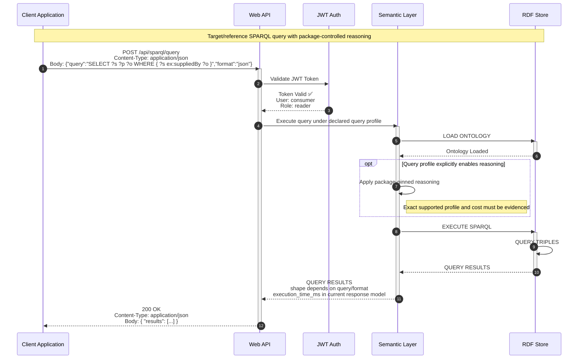

# ProvChainOrg Data Flow Architecture

**Version:** 1.1
**Last Updated:** 2026-08-31
**Author:** Anusorn Chaikaew (Student Code: 640551018)

---

Unless a section says **current foundation**, diagrams describe the ADR-accepted thesis target.
They are not evidence that the current runtime implements the flow. PBFT, heterogeneous/SPV bridge,
ERP/IoT product integration, operational deployment, and production-pilot controls are future work.

## 1. Universal Ledger Admission Flow

### 1.1 Overview

The normative flow below is the **accepted target** for every ledger write: ordinary provenance,
privacy control, and bounded bridge import. No adapter, Web API handler, sync path, privacy path, or
bridge path may append directly or mutate an authoritative side table.

The current runtime is only a **partial foundation**. Existing handlers and blockchain methods can
add to process-local chain/RDF state, but they do not yet evidence the universal Final Admission
boundary, complete-envelope append-only journal, crash recovery, or three-node exact-envelope
convergence described here.

### 1.2 Flow Diagram

```mermaid
sequenceDiagram
    autonumber
    participant C as Client or Relayer
    participant A as Authenticated Adapter
    participant PC as PoA Proposal Coordinator
    participant SA as Scheduled Authority
    participant FA as Final Admission
    participant J as Append-only Ledger Journal
    participant P as Rebuildable Projections
    participant N as Authenticated Peers

    Note over C,N: Accepted target: one write boundary for every request kind
    C->>A: Unsigned ordinary/privacy/bridge request
    A->>PC: Canonical bounded request + authenticated principal/evidence
    PC->>PC: Serialize all request kinds and complete non-mutating preflight
    alt Parent advances while request is unselected and unfenced
        PC->>PC: Refresh verified parent and rerun every preflight gate
    else Request selected for this PoA turn
        PC->>PC: Durably fence one exact unsigned proposal body and digest
        PC->>SA: Exact fenced proposal body
        SA-->>PC: At most one distinct signature for the scheduled turn
        PC->>FA: Exact signed proposal and kind-specific evidence
        FA->>FA: Verify profile, parent, turn, Scheduled Authority, signature, bounds
        FA->>FA: Verify membership/auth, RDF/state commitment, and kind-specific rules
        FA->>FA: Enforce package-declared full-union SHACL + candidate focus
        alt Every gate passes
            FA->>FA: Construct complete Admitted Block Envelope
            FA->>J: Append complete envelope + fsync
            Note over J: Sole authoritative commit point
            J-->>FA: Durably committed
            FA->>P: Apply/rebuild chain, Oxigraph, and indexes after commit
            FA->>N: Replicate exact committed envelope + prefix
            N-->>FA: Matching Commit Receipts as nodes durably commit
            FA-->>A: Node-committed receipt; convergence only at all 3 receipts
        else Deterministic rejection
            FA-->>PC: Rejected; no journal or authoritative mutation
            Note over PC,FA: Safety incident stalls this turn; no replacement proposal
        else Node incapable or commit outcome unknown
            FA-->>PC: No global rejection verdict
            PC->>PC: Recover verified journal and Signing Fence
            Note over PC,FA: Retry only the exact fenced signed proposal if uncommitted
        end
    end
```

### 1.3 Step-by-Step Breakdown

| Stage | Normative rule | Current evidence state |
|-------|----------------|------------------------|
| Adapter | Authentication and parsing produce an unsigned bounded request; they never commit | Partial HTTP/JWT foundation |
| Proposal coordination | All request kinds share one serialized coordinator, verified parent, and durable signing fence | Accepted target; pending |
| Authority signing | Only the scheduled manifest authority may sign, at most one body per PoA turn | Accepted target; pending |
| Final Admission | The same fail-closed gates apply to local, replicated, privacy, and bridge writes | Accepted target; pending |
| Semantic gate | The package declares shapes; validate the full staged union and require candidate focus | Accepted target; pending |
| Commit | Append and `fsync` one complete Admitted Block Envelope; nothing else is commitment | Accepted target; pending |
| Projection | In-memory chain, Oxigraph, and indexes apply only after commit and rebuild by journal replay | Accepted target; pending |
| Convergence | All three pinned nodes commit identical envelope bytes and prefix before convergence is claimed | Accepted target; pending |

Latency and throughput claims require the exact runtime profile, ontology package, dataset, hardware,
`fsync` policy, and node topology to be archived with the evidence.

### 1.4 Error Handling

**Before selection:** malformed, unauthorized, semantically invalid, or conflicting requests can be
rejected with no mutation. A parent refresh is allowed only while the request remains unselected,
fence persistence has not begun, and the signer has not been invoked.

**After selection:** a deterministic Final Admission failure is a safety incident that stalls the
turn; it never authorizes a replacement proposal. A missing Scheduled Authority also stalls the
turn. There is no authority takeover, alternative-peer acceptance shortcut, or fork-choice rule.

**Unknown outcome:** recover the verified journal and Signing Fence. If the exact envelope is not
committed, retry only the exact fenced proposal/signature; never construct or sign a substitute.

---

## 2. SPARQL Query Flow

### 2.1 Overview

Current HTTP/SPARQL and Oxigraph code provides a query foundation over projected RDF state. The
reasoning-enhanced sequence below is an **accepted target/reference flow**, not proof that every
current `/api/sparql/query` request loads a package and executes the illustrated OWL2 reasoning.
Queries are read-only: neither query execution nor inferred triples may become ledger truth except
through a later request that passes universal Final Admission.

### 2.2 Flow Diagram


```mermaid
sequenceDiagram
    autonumber
    participant Client as Client Application
    participant WebAPI as Web API
    participant JWT as JWT Auth
    participant Semantic as Semantic Layer
    participant RDFStore as RDF Store

    Note over Client,RDFStore: Target/reference SPARQL query with package-controlled reasoning

    Client->>WebAPI: POST /api/sparql/query<br/>Content-Type: application/json<br/>Body: {"query":"SELECT ?s ?p ?o WHERE { ?s ex:suppliedBy ?o }","format":"json"}
    activate WebAPI

    WebAPI->>JWT: Validate JWT Token
    JWT-->>WebAPI: Token Valid ✅<br/>User: consumer<br/>Role: reader
    WebAPI->>Semantic: Execute query under declared query profile
    activate Semantic

    Semantic->>RDFStore: LOAD ONTOLOGY
    activate RDFStore
    RDFStore-->>Semantic: Ontology Loaded
    deactivate RDFStore

    opt Query profile explicitly enables reasoning
        Semantic->>Semantic: Apply package-pinned reasoning
        Note right of Semantic: Exact supported profile and cost must be evidenced
    end

    Semantic->>RDFStore: EXECUTE SPARQL
    activate RDFStore
    RDFStore->>RDFStore: QUERY TRIPLES
    RDFStore-->>Semantic: QUERY RESULTS
    deactivate RDFStore

    Semantic-->>WebAPI: QUERY RESULTS<br/>shape depends on query/format<br/>execution_time_ms in current response model
    deactivate Semantic

    WebAPI-->>Client: 200 OK<br/>Content-Type: application/json<br/>Body: { "results": [...] }
    deactivate WebAPI
```

### 2.3 Step-by-Step Breakdown

| Step | Component | Action | Evidence Boundary |
|------|-----------|--------|-------------------|
| **1** | Client | Submit SPARQL query | Request-shape example |
| **2** | Web API | Extract and verify JWT | Implementation path; benchmark separately |
| **3** | Semantic Layer | Load active ontology context when required | Evidence-scoped |
| **4** | Semantic Layer | Apply package-pinned reasoning only when the query profile requires it | Accepted target; direct-query foundation exists |
| **5** | RDF Store | Execute SPARQL query | Evidence-scoped |
| **6** | Semantic Layer | Format results (JSON) | Evidence-scoped |
| **7** | Web API | Return results to client | Request-shape example |

**Timing:** Query latency depends on dataset size, query shape, reasoning/validation path, and hardware. Use current benchmark artifacts rather than fixed values in this architecture reference.

### 2.4 Query Optimization

Oxigraph indexing is an implementation foundation, but no specific index layout, LRU size, TTL, or
cache-hit performance is claimed here. Any query cache must be projection-only, keyed by the
committed prefix/profile, and safely discardable during replay or repair.

---

## 3. Block Synchronization Flow

### 3.1 Overview

The accepted target synchronizes **complete committed Admitted Block Envelopes**, never reconstructed
bare blocks, headers, RDF-store snapshots, or metadata-only summaries. The joining node first
verifies the governance-signed manifest and mutually authenticates the peer session, then requests
a contiguous prefix/range. Every received envelope traverses ordinary Final Admission and the local
journal commit boundary before projections advance.

Current networking/synchronization code is a partial foundation and does not yet evidence this
exact-envelope, authenticated, restart-safe protocol.

### 3.2 Flow Diagram

```mermaid
sequenceDiagram
    autonumber
    participant N as Joining or Lagging Node
    participant M as Verified Membership Manifest
    participant P as Pinned Authenticated Peer
    participant PJ as Peer Journal
    participant FA as Local Final Admission
    participant LJ as Local Journal
    participant RP as Local Projections

    N->>M: Verify governance signature, ledger/profile, epoch, and peer keys
    N->>P: Mutual Ed25519 challenge-response
    P-->>N: Authenticated manifest-listed session
    N->>P: Request contiguous envelopes after verified local prefix
    P->>PJ: Read exact committed envelope bytes + prefix evidence
    PJ-->>P: Bounded contiguous range
    P-->>N: Exact envelopes + prefix evidence
    loop Each next exact envelope in order
        N->>FA: Unchanged envelope bytes
        FA->>FA: Run every ordinary Final Admission gate
        alt Valid next envelope
            FA->>LJ: Append exact complete envelope + fsync
            LJ-->>FA: Node-committed
            FA->>RP: Apply/rebuild projections
            N-->>P: Signed Commit Receipt for exact envelope and prefix
        else Deterministic invalidity
            FA-->>N: Reject; no journal/projection mutation
        else Local incapacity or unknown commit outcome
            FA-->>N: No global invalidity verdict
            N->>LJ: Recover and inspect verified prefix before exact retry
        end
    end
```

### 3.3 Sync Strategies

| Target mode | Rule | Claim boundary |
|-------------|------|----------------|
| Genesis catch-up | Fetch and admit every exact complete envelope in bounded contiguous ranges | No trusted snapshot shortcut |
| Incremental catch-up | Continue only from a locally verified journal prefix | No header-only or RDF-state commitment |
| Live replication | Producer sends the exact envelope it just committed; receiver returns its own receipt only after local `fsync` | Receipt proves node-local commitment, not PBFT/SPV finality |
| Projection recovery | Replay the verified local journal without network authority | In-memory chain, Oxigraph, and indexes remain discardable |

---

## 4. Bounded ProvChain-to-ProvChain Bridge Flow

### 4.1 Overview

[ADR 0037](./ADR/0037-bound-provchain-bridge-to-converged-source-evidence-and-final-admission.md)
accepts one exact-public-payload, one-hop ProvChain bridge contract. The architecture is accepted;
implementation and six-node conformance evidence are pending. The current in-process bridge module
does not implement this flow.

### 4.2 Flow diagram

```mermaid
sequenceDiagram
    autonumber
    participant SJ as Source Journal
    participant SN as Source Nodes (3)
    participant R as Relayer
    participant BA as Target Bridge Adapter
    participant PC as Target PoA Proposal Coordinator
    participant TA as Target Scheduled Authority
    participant FA as Target Final Admission
    participant TJ as Target Journal
    participant TN as Target Nodes (3)

    Note over SJ: Exact source envelope already contains<br/>target-bound Bridge Export Declaration
    SJ->>SN: Replicate exact envelope + Ledger Prefix Hash
    SN-->>R: Exactly 3 distinct matching Commit Receipts
    R->>BA: Canonical Bridge Proof Bundle + unchanged public payload
    BA->>BA: Strict decode/bounds + read verified Effective Bridge State
    alt Exact transfer already committed
        BA-->>R: AlreadyImported + stored target reference; no candidate
    else Same Transfer ID conflicts
        BA-->>R: ReplayConflict; no candidate
    else Transfer ID absent
        BA->>PC: Unsigned exact proof + unchanged payload request
        PC->>PC: Serialize all request kinds; coalesce byte-identical requests
        PC->>PC: Complete non-mutating preflight at one verified parent
        alt Parent advances before selection/fence persistence
            PC->>PC: Refresh parent and rerun every preflight gate
            PC-->>BA: Still unselected/unfenced; signer not invoked
        else Request selected for current turn
            PC->>PC: Durably fence exact unsigned proposal body and digest
            PC->>TA: Exact fenced canonical proposal body
            TA-->>PC: At most one distinct signature for this PoA Turn
            PC->>FA: Exact signed ordinary proposal + Bridge Origin Evidence
            FA->>FA: Verify target ledger/profile/turn
            FA->>FA: Verify pinned source profile/manifest/root and 3/3 receipts
            FA->>FA: Recompute Transfer ID and compare exact payload bytes
            FA->>FA: Require absence in parent Effective Bridge State
            FA->>FA: Run target state commitment + package/full-union SHACL gates
            alt Every gate passes
                FA->>TJ: Append complete target envelope + fsync
                TJ->>TN: Replicate exact target envelope
                TN-->>R: Target receipts; Bridge-Converged only at 3/3
            else Deterministic rejection
                FA-->>PC: Rejected; no authoritative mutation
                Note over PC,FA: Safety incident and stalled turn;<br/>never sign a replacement
            else Node incapable or commit outcome unknown
                FA-->>PC: No global verdict
                PC->>PC: Recover journal and Signing Fence; query Transfer ID
                alt Transfer is now Imported or conflicting
                    PC-->>BA: Derive AlreadyImported or ReplayConflict
                else Turn and transfer remain uncommitted
                    PC->>FA: Retry only the exact fenced signed proposal
                end
            end
        end
    end
```

### 4.3 Key considerations

**Trust and security:**

- proof-carried keys never create trust; the target profile pins the source ledger, root, profile,
  manifest, three receipt identities, and permitted contracts;
- source receipts establish the bounded all-three convergence condition, not SPV or BFT finality;
- source evidence never bypasses the target Scheduled Authority or target semantic admission; and
- imported envelopes cannot be exported again in v1.

**Consistency and recovery:**

- the Bridge Transfer ID is a derived digest, not a caller UUID;
- Effective Bridge State is rebuilt from target journal history, not an external replay table;
- a lost response after target `fsync` resolves to `AlreadyImported` on exact retry; and
- target-local Imported and target three-node Bridge-Converged are distinct facts.

An unrelated target commit may refresh the bridge request only while it remains unselected, fence
persistence has not begun, and the signer has not been invoked. The PoA Proposal Coordinator then
reruns complete preflight for the later turn. Once selection or a fence-write attempt begins, the
exact body remains locked even if the signer response is unknown; recovery may produce or retry
only its deterministic exact signature. A distinct proposal for that turn is Equivocation, and
Final Admission never chooses a first winner. An observed committed transfer maps to
`AlreadyImported` or `ReplayConflict` only after verified journal refresh.

**Claim boundary:**

There is no ontology mapping, private-data bridge, multihop, lock/mint, heterogeneous/SPV support,
exactly-once delivery, or production latency claim. Bridge performance may be reported only after
the full reproducible conformance campaign exists.

---

## 5. Future Real-Time Data Flow (IoT Integration)

### 5.1 Overview

This is a **future integration sketch**, not a current endpoint or thesis evidence path. The current
generic `/ws` endpoint supports event subscriptions; it is not sensor ingestion, and `/ws/iot` is
not a current route. A future IoT adapter must authenticate devices, enforce explicit bounds,
transform readings under a pinned ontology package, and submit unsigned requests through the same
universal Final Admission path as every other writer.

### 5.2 Flow Diagram


```mermaid
flowchart LR
    IoT["IoT Sensor"] -->|"Future authenticated transport"| Adapter["Future IoT Adapter"]
    Adapter -->|"Bound, validate, transform"| Package["Pinned Ontology Package"]
    Package -->|"Unsigned ordinary request"| Coordinator["PoA Proposal Coordinator"]
    Coordinator -->|"Scheduled-authority proposal"| Admission["Universal Final Admission"]
    Admission -->|"Complete envelope append + fsync"| Journal["Ledger Journal"]
    Journal -->|"After commit"| Projection["Rebuildable RDF Projection"]
```

### 5.3 Data Format

The following payload and RDF are illustrative design fixtures only; they are not a declared wire
schema, route contract, supported device list, or proof of package conformance.

**Illustrative adapter input:**
```json
{
  "sensor_id": "temp_sensor_001",
  "timestamp": "2026-01-28T10:15:00Z",
  "temperature": 4.5,
  "humidity": 65,
  "location": "warehouse_a"
}
```

**Illustrative RDF candidate:**
```turtle
@prefix iot: <http://provchain.org/iot/> .
@prefix xsd: <http://www.w3.org/2001/XMLSchema#> .

iot:temp_sensor_001
    iot:timestamp "2026-01-28T10:15:00Z"^^xsd:dateTime ;
    iot:temperature 4.5 ;
    iot:humidity 65 ;
    iot:location "warehouse_a" .
```

---

## 6. Performance Characteristics

| Flow Type | Latency (P95) | Throughput | Bottleneck |
|-----------|----------------|------------|------------|
| **Universal Final Admission** | Pending end-to-end campaign | Pending end-to-end campaign | Package validation, journal `fsync`, replication |
| **SPARQL Query Foundation** | Quote only reproducible workload artifacts | Quote only reproducible workload artifacts | Dataset/query/profile dependent |
| **Exact-envelope Sync** | Pending three-process campaign | Pending three-process campaign | Authentication, range transfer, local admission/`fsync` |
| **Bounded Bridge** | No performance claim | No performance claim | Six-process conformance evidence must come first |
| **Future IoT/ERP Adapters** | Not measured | Not measured | Outside locked thesis boundary |

---

## 7. Error Handling & Recovery

### 7.1 Error Scenarios

| Error | Detection | Recovery | Impact |
|-------|----------|----------|--------|
| **Deterministic admission failure** | Universal Final Admission | Reject with no authoritative mutation; if already selected, record a safety incident and stall the turn | No replacement proposal |
| **Scheduled Authority absent** | Coordinator turn timer/state | Stall the missed turn | No takeover, peer shortcut, or fork choice |
| **Invalid/unauthenticated peer** | Manifest and mutual challenge-response | Close session; use only another manifest-listed authenticated source for the same exact missing prefix | Never accept a competing envelope |
| **Local journal capacity/I/O failure** | Append/`fsync` result | Treat node as incapable; repair capacity and recover journal | No global invalidity verdict |
| **Commit outcome unknown** | Lost response/crash around `fsync` | Recover journal and Signing Fence; derive committed state or retry only exact fenced signed bytes | No newly signed substitute |
| **Projection failure** | Chain/Oxigraph/index apply or replay check | Discard/repair projection and rebuild from the verified journal | Committed journal remains authority |

### 7.2 Retry Mechanisms

**Ledger admission:** A client may retry an unsigned request under an explicit idempotency contract
before selection. Once selected/fenced, coordinator recovery may emit only the exact proposal and
deterministic signature. Backoff values are deployment choices, not consensus rules.

**SPARQL query:** Do not retry syntax/authorization failures. Timeout retries and any cache policy
belong to the client/deployment profile and must not turn query results into ledger state.

**Block synchronization:** Reconnect only to a manifest-listed mutually authenticated peer, request
the same next exact envelope/range from the verified local prefix, and run Final Admission locally.
Another peer is a transport source, never an alternative authority or winner. Retry limits and rate
limits must be bounded by the active profile and evidence harness.

---

## 8. Related Documentation

### Internal
- [Container Architecture](./CONTAINER_ARCHITECTURE.md) - Container interactions
- [Component Architecture](./COMPONENT_ARCHITECTURE.md) - Component-level flows
- [Security Architecture](./SECURITY_ARCHITECTURE.md) - Secure data flow

### External
- [ADR 0006: Dual Consensus](./ADR/0006-dual-consensus-protocol.md) - Historical dual-consensus decision; PBFT is future work under the locked thesis boundary
- [ADR 0007: WebSocket P2P](./ADR/0007-websocket-p2p-protocol.md) - P2P communication
- [src/web/server.rs](../../src/web/server.rs) - Web API implementation

---

**Contact:** Anusorn Chaikaew (Student Code: 640551018)
**Thesis Advisor:** Associate Professor Dr. Ekkarat Boonchieng
**Department:** Computer Science, Faculty of Science, Chiang Mai University
