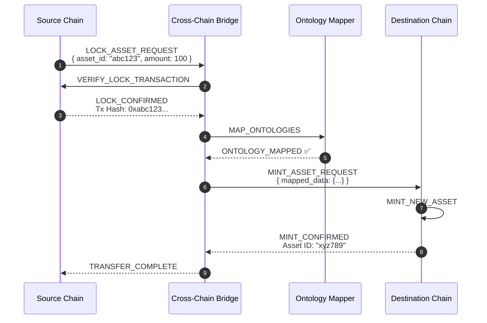

# ProvChainOrg Integration Architecture

**Version:** 1.0
**Last Updated:** 2026-01-28
**Author:** Anusorn Chaikaew (Student Code: 640551018)

---

## 1. External System Integrations

### 1.1 ERP System Integration

**Purpose:** Automated transaction submission from enterprise systems

**Protocol:** REST API with JWT authentication

**Authentication:**
```bash
# Get JWT token
curl -X POST http://provchain-api:8080/auth/login \
  -H "Content-Type: application/json" \
  -d '{"username": "erp_user", "password": "..."}'

# Submit transactions
curl -X POST http://provchain-api:8080/api/transactions \
  -H "Authorization: Bearer <JWT_TOKEN>" \
  -H "Content-Type: text/turtle" \
  --data-binary @transaction.ttl
```

**Batch Submission:**
```python
import requests

# Batch submit 1000 transactions
transactions = [f"transaction_{i}.ttl" for i in range(1000)]

headers = {
    "Authorization": f"Bearer {jwt_token}",
    "Content-Type": "text/turtle"
}

for tx_file in transactions:
    with open(tx_file, 'rb') as f:
        response = requests.post(
            "http://provchain-api:8080/api/transactions",
            headers=headers,
            data=f
        )
        assert response.status_code == 201
```

**Integration with SAP/Oracle/Dynamics:**
- Use middleware connectors to transform ERP data to RDF
- Map ERP entities to ProvChain ontology
- Schedule batch jobs for periodic data sync

---

### 1.2 IoT Sensor Integration

**Purpose:** Real-time sensor data for cold chain monitoring

**Protocol:** WebSocket or MQTT

**WebSocket Integration:**
```javascript
// IoT sensor connection
const ws = new WebSocket('ws://provchain-api:8080/ws/iot');

// Send sensor data
ws.send(JSON.stringify({
  sensor_id: "temp_001",
  timestamp: "2026-01-28T10:15:00Z",
  temperature: 4.5,
  humidity: 65,
  location: "warehouse_a"
}));
```

**MQTT Integration (Future):**
```python
import paho.mqtt.client as mqtt

def on_connect(client, userdata, flags, rc):
    client.subscribe("sensors/temperature/#")

def on_message(client, userdata, msg):
    # Forward to ProvChainOrg
    submit_to_provchain(msg.payload)

client = mqtt.Client()
client.on_connect = on_connect
client.on_message = on_message
client.connect("mqtt://provchain-mqtt-broker")
client.loop_forever()
```

**Data Types Supported:**
- Temperature readings (2-8°C for pharmaceuticals)
- GPS location tracking
- Humidity levels
- Shock/vibration events

---

## 2. Cross-Chain Bridge

### 2.1 Lock & Mint Protocol

**Overview:** Transfer assets between ProvChainOrg and other blockchains by locking assets on source and minting equivalent on destination.

### 2.2 Protocol Flow



### 2.3 Ontology Mapping

**Source Ontology (ProvChainOrg):**
```turtle
@prefix ex: <http://provchain.org/> .

ex:Product a ex:Product ;
    ex:hasOwner "Alice" ;
    ex:suppliedBy "ManufacturerX" .
```

**Destination Ontology (External Chain):**
```turtle
@prefix prod: <http://external-chain.org/> .

prod:Product a prod:Product ;
    prod:hasOwner "Alice" ;
    prod:manufacturedBy "ManufacturerX" .
```

**Mapping Rules:**
```javascript
const mappings = {
  "http://provchain.org/Product": "http://external-chain.org/Product",
  "http://provchain.org/hasOwner": "http://external-chain.org/hasOwner",
  "http://provchain.org/suppliedBy": "http://external-chain.org/manufacturedBy"
};
```

---

## 3. API Reference

### 3.1 REST API Endpoints

#### Authentication

```http
POST /auth/login
Content-Type: application/json

{
  "username": "supply_chain_manager",
  "password": "password123"
}
```

**Response:**
```http
HTTP/1.1 200 OK
Content-Type: application/json

{
  "access_token": "eyJhbGciOiJIUzI1NiIsInR5cCI6IkpXVCJ9...",
  "token_type": "bearer",
  "expires_in": 86400
}
```

#### Submit Transaction

```http
POST /api/transactions
Authorization: Bearer <JWT_TOKEN>
Content-Type: text/turtle

@prefix ex: <http://example.org/> .
ex:Product ex:name "Widget" .
```

**Response:**
```http
HTTP/1.1 201 Created
Content-Type: application/json

{
  "block_hash": "0xdef456...",
  "block_number": 42,
  "transaction_count": 1
}
```

#### SPARQL Query

```http
POST /api/query
Authorization: Bearer <JWT_TOKEN>
Content-Type: application/sparql-query

SELECT ?s ?p ?o WHERE {
  ?s ex:suppliedBy ?o .
  ?o ex:locatedIn "warehouse_a"
}
```

**Response:**
```http
HTTP/1.1 200 OK
Content-Type: application/json

{
  "results": [
    {
      "s": "http://provchain.org/block/42#product1",
      "p": "http://provchain.org/ontology/suppliedBy",
      "o": "http://provchain.org/ontology/warehouse_a"
    }
  ],
  "query_time_ms": 15
}
```

### 3.2 WebSocket API

#### Connect to P2P Network

```javascript
const ws = new WebSocket('ws://provchain-api:8080/ws');

// Subscribe to new blocks
ws.send(JSON.stringify({
  type: "subscribe",
  channel: "blocks"
}));

// Receive blocks
ws.onmessage = (event) => {
  const message = JSON.parse(event.data);
  if (message.type === "new_block") {
    console.log("New block:", message.block);
  }
};
```

#### WebSocket Message Types

| Type | Direction | Description |
|------|-----------|-------------|
| `subscribe` | Client → Server | Subscribe to channel |
| `unsubscribe` | Client → Server | Unsubscribe from channel |
| `new_block` | Server → Client | New block created |
| `vote` | Server → Client | Consensus vote |
| `sync_request` | Node → Node | Synchronization request |
| `sync_response` | Node → Node | Synchronization response |

---

## 4. Integration Patterns

### 4.1 Webhook Notifications

**Purpose:** Notify external systems of blockchain events

**Configuration:**
```toml
[webhooks]
enabled = true
url = "https://external-system.example.com/webhook"
events = ["block_created", "transaction_submitted"]
secret = "webhook_secret_key"
```

**Webhook Payload:**
```json
{
  "event": "block_created",
  "timestamp": "2026-01-28T10:15:00Z",
  "block": {
    "hash": "0xdef456...",
    "number": 42,
    "transaction_count": 100
  },
  "signature": "0xabc123..."
}
```

### 4.2 Polling vs Push

| Pattern | Use Case | Pros | Cons |
|--------|---------|------|------|
| **Polling** | Legacy systems | Simple, no webhook needed | High latency, server load |
| **WebSocket Push** | Real-time updates | Low latency, efficient | Requires persistent connection |
| **Webhook** | Event notification | Decoupled, async | Delivery retries needed |

---

## 5. Integration Testing

### 5.1 Test Scenarios

**ERP Integration Test:**
```bash
# Test batch transaction submission
./tests/integration/erp_integration_test.sh
```

**IoT Integration Test:**
```bash
# Test WebSocket sensor data submission
./tests/integration/iot_sensor_test.sh
```

**Cross-Chain Bridge Test:**
```bash
# Test asset transfer between chains
./tests/integration/cross_chain_test.sh
```

---

## 6. Related Documentation

- [Data Flow Architecture](./DATA_FLOW_ARCHITECTURE.md) - Detailed flow diagrams
- [Container Architecture](./CONTAINER_ARCHITECTURE.md) - Container interactions
- [Security Architecture](./SECURITY_ARCHITECTURE.md) - Secure integrations

---

**Contact:** Anusorn Chaikaew (Student Code: 640551018)
**Thesis Advisor:** Associate Professor Dr. Ekkarat Boonchieng
