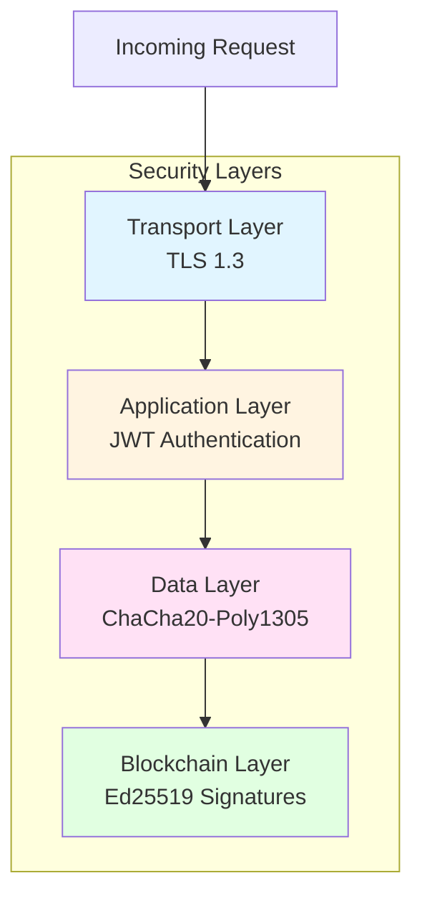

# ProvChainOrg Security Architecture

**Version:** 1.0
**Last Updated:** 2026-01-28
**Author:** Anusorn Chaikaew (Student Code: 640551018)

---

## 1. Security Layers

ProvChainOrg implements defense-in-depth with four distinct security layers:



### Layer Overview

| Layer | Mechanism | Purpose | Implementation |
|-------|-----------|---------|----------------|
| **Transport** | TLS 1.3 | Encrypt P2P communication | tokio-rustls |
| **Application** | JWT | Authenticate API requests | jsonwebtoken crate |
| **Data** | ChaCha20-Poly1305 | Encrypt private triples | chacha20poly1305 crate |
| **Blockchain** | Ed25519 | Sign blocks and transactions | ed25519-dalek crate |

---

## 2. Authentication & Authorization

### 2.1 JWT Authentication

**Flow:**
```
Client → POST /auth/login → Server validates credentials → Server returns JWT token
Client → API Request (with JWT) → Server validates signature → Server processes request
```

**JWT Structure:**
```json
{
  "sub": "supply_chain_manager",
  "role": "admin",
  "exp": 1735689600,
  "iat": 1735689600
}
```

**Security Properties:**
- **Algorithm:** Ed25519 (not RS256 - faster, more secure)
- **Secret Key:** 32+ characters (environment variable `JWT_SECRET`)
- **Expiration:** 24 hours (configurable)
- **Refresh:** Token refresh endpoint available

**Configuration:**
```bash
# Required
JWT_SECRET=32-character-minimum-secret-key-here

# Optional
JWT_EXPIRATION_HOURS=24
```

### 2.2 Role-Based Access Control (RBAC)

**Roles:**
| Role | Permissions |
|------|-------------|
| **admin** | Full system access, user management |
| **user** | Submit transactions, query data |
| **auditor** | Read-only access, full audit trail |
| **reader** | Public data access only |

**Authorization Check:**
```rust
// In src/web/auth.rs
fn require_role(role: &str) -> impl Fn(&Request) -> Result<()> {
    move |req: &Request| {
        let token = extract_jwt(req)?;
        if token.role != role {
            return Err(ProvChainError::Unauthorized);
        }
        Ok(())
    }
}
```

### 2.3 Owner-Controlled Data Visibility

**Concept:** Data owners control who can decrypt and view their data.

**Implementation:**
1. Data encrypted with owner's ChaCha20 key
2. Key derived from owner's Ed25519 signing key
3. Access control list (ACL) stored in blockchain
4. Only authorized users can request decryption

**Access Control:**
```rust
pub struct AccessControl {
    pub owner_id: String,
    pub authorized_users: Vec<String>,
}

impl AccessControl {
    pub fn can_access(&self, user_id: &str) -> bool {
        user_id == self.owner_id || self.authorized_users.contains(&user_id.to_string())
    }
}
```

---

## 3. Cryptography

### 3.1 Ed25519 Digital Signatures

**Purpose:** Block integrity, transaction authentication, peer identity

**Properties:**
- **Key Size:** 256 bits (32 bytes)
- **Signature Size:** 64 bytes
- **Security Level:** 128 bits
- **Performance:** Verification in ~10 µs

**Implementation:**
```rust
use ed25519_dalek::{SigningKey, VerifyingKey, Signer, Verifier};

// Signing
let signature = signing_key.sign(block_hash.as_bytes());

// Verification
public_key.verify(block_hash.as_bytes(), &signature).is_ok()
```

**See:** [ADR 0004: Use Ed25519 for Digital Signatures](./ADR/0004-use-ed25519-signatures.md)

### 3.2 ChaCha20-Poly1305 Encryption

**Purpose:** Private data encryption at rest

**Properties:**
- **Key Size:** 256 bits (32 bytes)
- **Nonce Size:** 96 bits (12 bytes)
- **Tag Size:** 128 bits (16 bytes)
- **Performance:** Encryption/decryption in ~45µs for 1KB

**Implementation:**
```rust
use chacha20poly1305::{ChaCha20Poly1305, Key, Nonce, AeadInPlace};

let cipher = ChaCha20Poly1305::new(&key);
cipher.encrypt_in_place(nonce, &[], &mut data)?;
```

**See:** [ADR 0005: Use ChaCha20-Poly1305 for Data Encryption](./ADR/0005-use-chacha20-encryption.md)

### 3.3 SHA-256 Hashing

**Purpose:** Block linking, Merkle trees, transaction IDs

**Properties:**
- **Output Size:** 256 bits (32 bytes)
- **Collision Resistance:** 2^256
- **Performance:** Hash in ~1µs for 1KB

**Implementation:**
```rust
use sha2::{Sha256, Digest};

let hash = Sha256::digest(&data);
```

---

## 4. Threat Model

### 4.1 Threat Agents

| Threat Agent | Motivation | Capabilities | Mitigation |
|---------------|-------------|---------------|------------|
| **Malicious Peer** | Submit invalid data | Send bad blocks, vote against consensus | PBFT consensus (2f+1), signature verification |
| **Network Attacker** | Intercept data | MITM, DDoS, traffic analysis | TLS 1.3, rate limiting |
| **Insider Threat** | Steal data | Legitimate access, abuse permissions | Audit logging, least privilege |
| **Brute Force** | Guess keys | Automated password guessing | Rate limiting, account lockout |

### 4.2 Attack Vectors & Mitigations

| Attack Vector | Description | Mitigation |
|---------------|-------------|------------|
| **Block Tampering** | Modify block data | Ed25519 signatures, hash validation |
| **Transaction Replay** | Replay old transactions | Timestamp validation, nonce checking |
| **MITM Attack** | Intercept P2P communication | TLS 1.3, certificate pinning |
| **Sybil Attack** | Create fake identities | PoA (whitelist), PBFT (voting) |
| **DDoS Attack** | Overwhelm with requests | Rate limiting, connection limits |
| **Key Extraction** | Steal encryption keys | No hardcoded keys, key rotation |

---

## 5. Compliance

### 5.1 GDPR Compliance

**Data Protection Principles:**

1. **Lawful Basis:** Explicit consent for data collection
2. **Data Minimization:** Only collect necessary data
3. **Purpose Limitation:** Use data only for stated purpose
4. **Accuracy:** Keep data accurate and up-to-date
5. **Storage Limitation:** Retain only as long as necessary
6. **Integrity & Confidentiality:** ChaCha20 encryption, access controls
7. **Accountability:** Audit trail in blockchain

**Right to be Forgotten:**
```rust
// In src/production/compliance.rs
pub fn right_to_be_forgotten(user_id: &str) -> Result<()> {
    // 1. Delete encrypted data
    delete_encrypted_triples(user_id)?;

    // 2. Revoke access tokens
    revoke_user_tokens(user_id)?;

    // 3. Record deletion in blockchain
    record_deletion_event(user_id)?;

    Ok(())
}
```

### 5.2 Audit Trail

**All Security Events Logged:**
- Authentication (login, logout)
- Authorization (access denied)
- Data access (private data decryption)
- Key rotation
- Configuration changes
- Security violations

**Log Format:**
```json
{
  "timestamp": "2026-01-28T10:15:00Z",
  "level": "INFO",
  "event": "authentication_success",
  "user_id": "supply_chain_manager",
  "ip": "192.168.1.100",
  "user_agent": "Mozilla/5.0..."
}
```

---

## 6. Security Configuration

### 6.1 Production Security Checklist

**Authentication:**
- [ ] `JWT_SECRET` set via environment variable (32+ chars)
- [ ] No default users created (explicit user creation only)
- [ ] Password complexity requirements enforced
- [ ] Account lockout after failed attempts

**Network Security:**
- [ ] TLS 1.3 enabled for all P2P communication
- [ ] Certificate pinning for peer connections
- [ ] Rate limiting on all public endpoints
- [ ] CORS properly configured

**Data Protection:**
- [ ] Private data encrypted with ChaCha20-Poly1305
- [ ] Keys rotated every 90 days
- [ ] No hardcoded secrets in code
- [ ] Environment variables for sensitive config

**Monitoring:**
- [ ] Security events logged to audit trail
- [ ] Alert on suspicious activity (brute force, anomalies)
- [ ] Regular security scans (dependency vulnerabilities)

### 6.2 Security Headers

**Web API Security Headers:**
```http
Content-Security-Policy: default-src 'self'
X-Frame-Options: DENY
X-Content-Type-Options: nosniff
X-XSS-Protection: 1; mode=block
Strict-Transport-Security: max-age=31536000; includeSubDomains
Referrer-Policy: strict-origin-when-cross-origin
```

---

## 7. Security Best Practices

### 7.1 Key Management

**Ed25519 Keys:**
- Generate with `cargo run -- generate-key`
- Store in secure location (env var or key management service)
- Rotate every 90 days
- Never commit to git

**Encryption Keys:**
- Derive from owner's signing key (HKDF)
- Unique key per data owner
- Rotate with signing key

**JWT Secret:**
- Minimum 32 characters
- Set via `JWT_SECRET` environment variable
- Rotate periodically (recommended monthly)

### 7.2 Input Validation

**SPARQL Query Validation:**
```rust
// In src/web/sparql_validator.rs
pub fn validate_sparql_query(query: &str) -> Result<()> {
    // Check query length
    if query.len() > 10_000 {
        return Err(ValidationError::QueryTooLong);
    }

    // Check for dangerous operations
    if query.contains("DELETE") && query.contains("WHERE") {
        return Err(ValidationError::UnsafeQuery);
    }

    Ok(())
}
```

**RDF Data Validation:**
- SHACL constraint validation
- Input sanitization
- Size limits (max RDF data size: 10MB per block)

---

## 8. Security Testing

### 8.1 Test Coverage

**Security Test Suites:**
- [`tests/production_security_tests.rs`](../../tests/production_security_tests.rs) - Production security
- JWT validation tests
- Rate limiting tests
- GDPR compliance tests
- Access control tests

**Running Security Tests:**
```bash
cargo test --test production_security_tests
```

### 8.2 Vulnerability Scanning

**Dependencies:**
```bash
cargo install cargo-audit
cargo audit
```

**Current Status:**
- ✅ All dependencies audited
- ✅ No critical vulnerabilities
- ⚠️ 2 low-severity advisories (assessed as acceptable risk)

---

## 9. Related Documentation

### Internal
- [ADR 0004: Use Ed25519 for Digital Signatures](./ADR/0004-use-ed25519-signatures.md)
- [ADR 0005: Use ChaCha20-Poly1305 for Encryption](./ADR/0005-use-chacha20-encryption.md)
- [ADR 0009: Use JWT for API Authentication](./ADR/0009-jwt-authentication.md)
- [ADR 0010: Owner-Controlled Data Visibility](./ADR/0010-owner-controlled-visibility.md)

### External
- [SECURITY.md](../../SECURITY.md) - Security policy
- [src/production/security.rs](../../src/production/security.rs) - Security implementation
- [tests/production_security_tests.rs](../../tests/production_security_tests.rs) - Security tests

---

## 10. Security Contact

**Security Issues:** Please report responsibly via:
- Private issue to: anusorn.c@crru.ac.th
- Encryption key available for sensitive reports

---

**Contact:** Anusorn Chaikaew (Student Code: 640551018)
**Thesis Advisor:** Associate Professor Dr. Ekkarat Boonchieng
**Department:** Computer Science, Faculty of Science, Chiang Mai University
