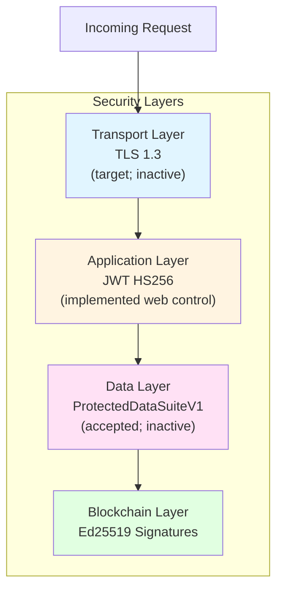

# ProvChainOrg Security Architecture

**Version:** 1.2
**Last Updated:** 2026-08-31
**Author:** Anusorn Chaikaew (Student Code: 640551018)

---

> **Current claim boundary:** this document contains both implemented security primitives and
> historical design sketches. JWT/RBAC authenticates and gates web operations but is not privacy
> authority. The accepted privacy architecture is the journal-authoritative `PrivacyControlV1`
> model in ADRs 0027-0036. ADR 0034 pins the mandatory `ProtectedDataSuiteV1` cryptographic and
> canonical-byte contract, ADR 0035 keeps participant private keys in durable client-only custody,
> and ADR 0036 pins the encrypted whole-snapshot custody suite. Their protected-object, grant,
> revocation, live-release, and custody-store implementation and profile activation remain pending.
> The complete-envelope Ledger Journal is accepted architecture whose implementation and evidence
> remain pending. Existing chain, RDF-store, WAL, or logging paths are not that journal and do not
> prove its append-only durability, replay, or privacy lifecycle.

## 1. Security Layers

The accepted defense-in-depth target has four security layers. Only the application JWT control and
the cryptographic primitives identified below are current implementation; transport activation,
the protected-data lifecycle, authenticated membership, and end-to-end evidence remain pending.


```mermaid
flowchart TB
    subgraph Security_Layers["Security Layers"]
        Transport["Transport Layer<br/>TLS 1.3<br/>(target; inactive)"]
        Application["Application Layer<br/>JWT HS256<br/>(implemented web control)"]
        Data["Data Layer<br/>ProtectedDataSuiteV1<br/>(accepted; inactive)"]
        Blockchain["Blockchain Layer<br/>Ed25519 Signatures"]
    end

    Request["Incoming Request"] --> Transport
    Transport --> Application
    Application --> Data
    Data --> Blockchain

    style Transport fill:#e1f5ff
    style Application fill:#fff4e1
    style Data fill:#ffe1f5
    style Blockchain fill:#e1ffe1
```

### Layer Overview

| Layer | Mechanism | Purpose | Current status |
|-------|-----------|---------|----------------|
| **Transport** | TLS 1.3 | Encrypt P2P communication | Target control; no activated P2P TLS or `tokio-rustls` implementation is evidenced |
| **Application** | JWT HS256 | Authenticate API requests | Implemented with `jsonwebtoken` and a shared `JWT_SECRET` |
| **Data** | `ProtectedDataSuiteV1` / ChaCha20Poly1305 | Protect immutable object payloads | Accepted contract; implementation inactive |
| **Blockchain** | Ed25519 | Sign blocks and transactions | Primitive implemented with `ed25519-dalek`; authenticated membership and three-node PoA evidence pending |

---

## 2. Authentication & Authorization

### 2.1 JWT Authentication

**Flow:**
```
Client → POST /auth/login → Server validates credentials → Server returns JWT token
Client → API Request (with JWT) → Server validates signature → Server processes request
```

**JWT Structure:**
```json
{
  "sub": "supply_chain_manager",
  "role": "admin",
  "exp": 1735689600
}
```

**Security Properties:**
- **Algorithm:** HS256 using the shared `JWT_SECRET`
- **Secret Key:** 32+ characters (environment variable `JWT_SECRET`)
- **Expiration:** 24 hours in the current token generator
- **Refresh:** No refresh-token route is implemented; clients must authenticate again after expiry

**Configuration:**
```bash
# Required
JWT_SECRET=32-character-minimum-secret-key-here

# The current token generator uses a fixed 24-hour lifetime.
```

### 2.2 Web Role-Based Access Control (separate from privacy authority)

These roles describe coarse web-operation policy only. No role, including `admin` or `auditor`,
substitutes for a Participant Authorization Signature or an Active Privacy Grant.

**Current web roles:** `farmer`, `processor`, `transporter`, `retailer`, `consumer`, `auditor`, and
`admin`. The current explicit privileged boundary is the `admin` check on user-management handlers;
other protected routes primarily distinguish authenticated from unauthenticated requests. Do not
infer a complete fine-grained RBAC matrix, auditor entitlement, public `reader` role, or privacy
authority from the role enum.

### 2.3 Owner-Controlled Data Visibility

**Accepted architecture; implementation pending:**

1. Participant Principal UUIDs are the sole privacy owner and grantee identities.
2. Dedicated, purpose-separated Participant Key Versions authorize privacy transitions; encryption
   or wrapping keys are never derived from a participant's Ed25519 authorization/signing key.
3. A Protected Object commits one immutable payload under one per-object DEK plus one Owner DEK
   Envelope; each Privacy Grant adds one Grant DEK Envelope without re-encrypting the payload.
4. ADR 0034 derives one payload key for exactly one use from that fresh per-object DEK and applies
   ChaCha20Poly1305 with the all-zero 12-byte nonce and raw 32-byte Object Encryption Context Digest
   `O` as associated data. This rule never permits reusing that derived key with the fixed nonce.
5. An Active grant is necessary but not sufficient for Live Privacy Release. The release boundary
   must also satisfy the profile-declared `ProtectedDataSuiteV1` at one exact Network-Converged prefix.
6. The server never decrypts a Protected Object. A successful release returns the exact committed
   ciphertext, exactly one applicable Owner or Grant DEK Envelope, and bound release evidence for
   client-side recovery and decryption.
7. JWT identity, web roles, local wallet possession, validator status, and PoA authority do not
   confer privacy authority.
8. ADR 0035 confines every participant passphrase and private key to a durable participant-side
   client boundary. Node/server state and backups hold only public bindings, ciphertext, envelopes,
   and evidence; custody presence never determines ledger lifecycle status.
9. ADR 0036 fixes one `ParticipantKeystoreSuiteV1`: exact printable-ASCII passphrases, Argon2id,
   separated one-use file keys, canonical encrypted snapshots, Linux/ext4 single-writer commit,
   byte-identical retry, verified backup, quarantined restore, and Revoked tombstone rewrite.

The current product code has ChaCha20-Poly1305 and local wallet primitives but does not yet implement
this grant-aware path. See ADRs 0027-0036 for the accepted architecture. The protected-data suite,
custody boundary, and encrypted-keystore specifications are accepted; implementation, conformance
evidence, and profile activation remain pending.

---

## 3. Cryptography

### 3.1 Ed25519 Digital Signatures

**Current purpose:** Block and transaction signing primitives. Authenticated peer identity requires
the pending governance-signed membership and mutual Ed25519 session protocol; key presence alone is
not membership evidence.

**Properties:**
- **Key Size:** 256 bits (32 bytes)
- **Signature Size:** 64 bytes
- **Security Level:** 128 bits

**Implementation:**
```rust
use ed25519_dalek::{SigningKey, VerifyingKey, Signer, Verifier};

// Signing
let signature = signing_key.sign(block_hash.as_bytes());

// Verification
public_key.verify(block_hash.as_bytes(), &signature).is_ok()
```

**See:** [ADR 0004: Use Ed25519 for Digital Signatures](./ADR/0004-use-ed25519-signatures.md)

### 3.2 Protected Payload Encryption Profile

**Accepted contract; implementation inactive.** ADR 0034 fixes the payload portion of
`ProtectedDataSuiteV1` as follows:

**Properties:**
- **Root key:** one fresh 32-byte per-object DEK, never an owner authorization/signing key
- **Payload key:** one 32-byte key derived for exactly one payload-encryption use
- **AEAD:** ChaCha20Poly1305
- **Nonce:** exactly 12 all-zero bytes, safe only under the mandatory one-use derived-key invariant
- **Associated data:** the exact raw 32 bytes of Object Encryption Context Digest `O`
- **Authentication tag:** 16 bytes

The existing helper uses a different raw-key/XChaCha construction and is legacy scaffolding, not an
implementation of this profile. No performance, FIPS-validation, HSM, or production-readiness claim
follows from accepting the suite.

**See:** [ADR 0005: Use ChaCha20-Poly1305 for Data Encryption](./ADR/0005-use-chacha20-encryption.md)
and [ADR 0034: Pin ProtectedDataSuiteV1 and Canonical Privacy Encoding](./ADR/0034-pin-protected-data-suite-v1-and-canonical-privacy-encoding.md)

### 3.3 SHA-256 Hashing

**Purpose:** Block linking and content/transaction identifiers

**Properties:**
- **Output Size:** 256 bits (32 bytes)
- **Generic collision-work factor:** approximately 2^128
- **Generic preimage-work factor:** approximately 2^256

**Implementation:**
```rust
use sha2::{Sha256, Digest};

let hash = Sha256::digest(&data);
```

---

## 4. Threat Model

### 4.1 Threat Agents

| Threat Agent | Motivation | Capabilities | Current mitigation and remaining target |
|---------------|------------|--------------|-----------------------------------------|
| **Malicious Peer** | Submit invalid data | Send bad blocks or equivocate | Signature/hash primitives exist; authenticated membership, Scheduled-Authority enforcement, universal Final Admission, and three-node PoA evidence remain pending. PBFT is future work, not a current mitigation. |
| **Network Attacker** | Intercept data | MITM, DDoS, traffic analysis | Rate-limiter scaffolding exists; active route coverage, TLS 1.3 transport, and deployment evidence remain pending. |
| **Insider Threat** | Steal data | Legitimate access, abuse permissions | Coarse JWT/RBAC exists; durable journal-derived privacy authority, audit evidence, and operational least-privilege controls remain pending. |
| **Brute Force** | Guess credentials or keys | Automated password guessing | Rate-limiter scaffolding exists; active route coverage and account lockout are not currently evidenced. |

### 4.2 Attack Vectors & Mitigations

| Attack Vector | Description | Current mitigation and remaining target |
|---------------|-------------|-----------------------------------------|
| **Block Tampering** | Modify block data | Ed25519 and hash primitives exist; universal fail-closed Final Admission, complete-envelope journal replay, and convergence evidence remain pending. |
| **Transaction Replay** | Replay old transactions | Existing transaction checks are partial; exact journal-derived replay and privacy/bridge replay contracts remain pending. |
| **MITM Attack** | Intercept P2P communication | TLS 1.3 and certificate pinning are target deployment/transport controls, not current implementation evidence. |
| **Sybil Attack** | Create fake identities | Governance-signed membership, mutual Ed25519 peer-session authentication, and Scheduled-Authority enforcement are accepted but pending. PBFT voting is future work. |
| **DDoS Attack** | Overwhelm with requests | Rate-limiter code/tests exist; active public-route coverage, connection limits, and operational deployment evidence remain pending. |
| **Key Extraction** | Steal protected-data keys | Accepted design uses purpose-separated wrapping keys, fresh per-object DEKs, durable client-only custody, and the bounded ADR 0036 encrypted snapshot suite without server escrow; implementation and evidence pending. |

### 4.3 Bounded bridge threat boundary

[ADR 0037](./ADR/0037-bound-provchain-bridge-to-converged-source-evidence-and-final-admission.md)
accepts the bridge security design but does not activate it. The target must fail closed with no
journal or Effective Bridge State mutation for:

- a substituted source network, Ledger Instance Identifier, profile, Membership Manifest, Governance
  Trust Root, semantic contract, or Ontology Package;
- a proof-supplied trust key, unknown/inactive/duplicate receipt signer, or fewer/more than the
  exact three pinned source receipts;
- a bridge receipt that does not match the exact `ed25519-dalek` 2.2.0 `verify_strict` acceptance
  profile under the default-off `fast,zeroize` feature graph, including its canonical-scalar, point,
  small-order, and strict-equation behavior; `legacy_compatibility` is forbidden throughout the
  resolved Cargo graph;
- receipt disagreement on source position, Envelope Hash, or Ledger Prefix Hash;
- a caller-selected or mutated transfer identifier, wrong target ledger, altered proof/payload, or
  conflicting reuse of an already Imported identifier;
- a private, privacy-control, transformed, subset, reformatted, or previously bridged payload;
- direct target append, an out-of-turn target signer, disabled/partial package validation, or any
  other target Final Admission bypass;
- a second distinct proposal signature for one PoA Turn, or any attempt to use target Final
  Admission as a first-wins arbiter between signed proposals; and
- an acknowledgement before target journal append plus `fsync`.

Under the accepted contract, Bridge Origin Evidence must be retained in the target envelope, and
terminal replay state must derive only from the target journal once implemented. Exact source
receipts provide all-three static source attestation; they do not prove SPV, BFT/trustless finality,
physical storage behavior, or relayer honesty.
Current `src/interop/bridge.rs` and its same-process replay tests are legacy prototype scaffolding,
not evidence that these controls exist.

Before either bridge ledger activates, all ordinary, privacy-control, and bridge unsigned requests
must share one PoA Proposal Coordinator. It must fully preflight and serialize requests, then bind
one exact proposal to the turn in a crash-safe Signing Fence before signature production. The fence
may restrict what the authority key can sign, but it cannot commit a block or replace the Ledger
Journal. Recovery may retry only the exact fenced signed bytes; a deterministic signed rejection
stalls the turn and a distinct signature is Equivocation.

---

## 5. Compliance

### 5.1 Data-Protection and GDPR Claim Boundary

The following are operational principles, not a claim of legal compliance or implemented erasure:

1. **Lawful Basis:** Explicit consent for data collection
2. **Data Minimization:** Only collect necessary data
3. **Purpose Limitation:** Use data only for stated purpose
4. **Accuracy:** Keep data accurate and up-to-date
5. **Storage Limitation:** Retain only as long as necessary
6. **Integrity & Confidentiality:** Profile-pinned cryptography and authorization, once implemented
7. **Accountability:** Target journal-derived audit evidence; implementation and operational policy pending

**Erasure claim boundary:**

The pending complete-envelope Ledger Journal is specified as append-only. Once implemented, it will
not delete or rewrite committed ciphertext or wrapped key bytes. Prospective grant revocation is
specified to stop later managed releases after the verified release prefix includes the revocation,
but it cannot recall plaintext or key material already learned. Off-ledger deletion, cryptographic
erasure, retention policy, data-subject workflows, and the legal sufficiency of those controls are
operational/production work; they are not demonstrated by the reference system.

### 5.2 Audit Trail

**Target audit coverage; implementation and immutable journal evidence pending:**
- Authentication (login, logout)
- Authorization (access denied)
- Live Privacy Release allow/deny decisions and non-secret prefix/evidence identifiers
- Ledger-derived participant-key lifecycle transitions
- Configuration changes
- Security violations

Current application logs do not establish this complete coverage or an immutable audit trail. A
conforming future audit path must never contain protected plaintext, an unwrapped DEK, a private
key, or a server-side decryption result.

**Log Format:**
```json
{
  "timestamp": "2026-01-28T10:15:00Z",
  "level": "INFO",
  "event": "authentication_success",
  "user_id": "supply_chain_manager",
  "ip": "192.168.1.100",
  "user_agent": "Mozilla/5.0..."
}
```

---

## 6. Security Configuration

### 6.1 Production Security Checklist

This is an activation/deployment checklist. An unchecked item is a required future control, not an
implemented capability or current production-readiness claim.

**Authentication:**
- [ ] `JWT_SECRET` set via environment variable (32+ chars)
- [ ] No default users created (explicit user creation only)
- [ ] Password complexity requirements enforced
- [ ] Account lockout after failed attempts

**Network Security:**
- [ ] TLS 1.3 enabled for all P2P communication
- [ ] Certificate pinning for peer connections
- [ ] Rate limiting on all public endpoints
- [ ] CORS properly configured

**Data Protection:**
- [ ] `ProtectedDataSuiteV1` implementation, canonical vectors, replay, and startup self-tests pass before profile activation
- [ ] Payload encryption uses a fresh per-object DEK, one-use derived key, all-zero 12-byte nonce, and raw `O` as AAD
- [ ] Live release returns ciphertext, exactly one applicable DEK envelope, and evidence for client-side decryption only
- [ ] Participant-key lifecycle is enforced from the ledger rather than a blanket wall-clock rotation schedule
- [ ] Participant private keys and passphrases remain in durable client-only custody; server and node backups contain none
- [ ] `ParticipantKeystoreSuiteV1` canonical vectors, guarded Argon arena, exact-retry, ext4 crash/failpoint, and startup recovery gates pass
- [ ] Custody restore rederives exact public bindings, reconciles Active/Retired/Revoked state from a verified ledger prefix, and never reactivates a key
- [ ] No hardcoded secrets in code
- [ ] No plaintext, unwrapped DEK, or private key enters logs, responses, or plaintext backups

**Monitoring:**
- [ ] Security events logged to audit trail
- [ ] Alert on suspicious activity (brute force, anomalies)
- [ ] Regular security scans (dependency vulnerabilities)

### 6.2 Security Headers

**Target deployment header policy:** verify the headers at the active TLS termination boundary;
this example is not operational evidence.
```http
Content-Security-Policy: default-src 'self'
X-Frame-Options: DENY
X-Content-Type-Options: nosniff
X-XSS-Protection: 1; mode=block
Strict-Transport-Security: max-age=31536000; includeSubDomains
Referrer-Policy: strict-origin-when-cross-origin
```

---

## 7. Security Best Practices

### 7.1 Key Management

**Ed25519 Keys:**
- Generate with `cargo run -- generate-key`
- Keep each key purpose separate and store private material according to the deployment threat model
- Follow the role-specific ledger or profile lifecycle; there is no blanket 90-day protocol rule
- Never commit to git

**Protected-Data Keys (accepted architecture; implementation pending):**
- Generate one fresh per-object DEK and derive the payload key for exactly one encryption use
- Never derive a DEK or wrapping key from an owner's authorization/signing key
- Address the DEK only to exact purpose-separated `privacy-key-wrapping` key versions
- Keep every participant private key and passphrase in the ADR 0035 client-only custody boundary;
  the server releases ciphertext and one envelope but never opens the store or decrypts
- Persist that boundary only through ADR 0036 whole-snapshot commit and quarantined restore; a
  direct overwrite, implementation-default KDF, plaintext export, or raw-backup installation is not conforming
- Retain exact Active and Retired versions, but resolve eligibility only from verified ledger state;
  conforming custody never lets a Retired authorization key sign or restores a Revoked key into use
- Do not claim recall: copied private material may remain usable offline despite managed-release and
  prospective-admission denial

**JWT Secret:**
- Minimum 32 characters
- Set via `JWT_SECRET` environment variable
- Rotate periodically (recommended monthly)

### 7.2 Input Validation

**SPARQL Query Validation:**

The compatibility helper in `src/web/sparql_validator.rs` constructs
`SparqlValidator::with_default_config()`, delegates to `validate`, and exposes failures as strings:

```rust
pub fn validate_sparql_query(query: &str) -> Result<(), String> {
    let validator = SparqlValidator::with_default_config();
    validator.validate(query).map_err(|e| e.to_string())
}
```

The validator's configured policy and heuristic checks define the current web-query guard; it does
not invoke a full SPARQL parser. This selected guard is not the pending package-declared Final
Admission contract.

**RDF Data Validation:**
- Current SHACL checks are partial; package-declared complete staged-union validation at every Final
  Admission path remains pending
- Input sanitization
- Size/message limits exist on selected paths; universal profile-bound admission limits remain pending

---

## 8. Security Testing

### 8.1 Test Coverage

**Current security test entry point:**
- [`tests/production_security_tests.rs`](../../tests/production_security_tests.rs) exercises parts of
  the existing web/security baseline.

Existing unit and integration tests do not prove the pending complete-envelope journal, universal
Final Admission, authenticated membership, three-node PoA convergence, `PrivacyControlV1`, TLS 1.3
transport, certificate pinning, account lockout, or operational deployment controls.

**Running Security Tests:**
```bash
cargo test --test production_security_tests
```

### 8.2 Vulnerability Scanning

**Dependencies:**
```bash
cargo install cargo-audit
cargo audit
```

**Evidence rule:** this document asserts no current clean-audit result. Record the command date,
tool version, lockfile digest, complete output, and disposition for every advisory before making a
dependency-security claim.

---

## 9. Related Documentation

### Internal
- [ADR 0004: Use Ed25519 for Digital Signatures](./ADR/0004-use-ed25519-signatures.md)
- [ADR 0005: Use ChaCha20-Poly1305 for Encryption](./ADR/0005-use-chacha20-encryption.md)
- [ADR 0009: Use JWT for API Authentication](./ADR/0009-jwt-authentication.md)
- [ADR 0027: Use Participant Principals for Privacy Identity](./ADR/0027-use-participant-principals-for-privacy-identity.md)
- [ADR 0028: Make Privacy Control Ledger-Authoritative](./ADR/0028-make-privacy-control-ledger-authoritative.md)
- [ADR 0032: Make Privacy Grant Revocation Terminal and Prospective](./ADR/0032-make-privacy-grant-revocation-terminal-and-prospective.md)
- [ADR 0033: Use One Immutable Ciphertext and Per-Object DEK Envelopes](./ADR/0033-use-one-immutable-ciphertext-and-per-object-dek-envelopes.md)
- [ADR 0034: Pin ProtectedDataSuiteV1 and Canonical Privacy Encoding](./ADR/0034-pin-protected-data-suite-v1-and-canonical-privacy-encoding.md)
- [ADR 0035: Keep Participant Private Keys in Durable Client-Only Custody](./ADR/0035-keep-participant-private-keys-in-durable-client-only-custody.md)
- [ADR 0036: Pin ParticipantKeystoreSuiteV1 and Whole-Snapshot Custody Commit](./ADR/0036-pin-participant-keystore-suite-v1-and-whole-snapshot-commit.md)

### External
- [SECURITY.md](../../SECURITY.md) - Security policy
- [src/production/security.rs](../../src/production/security.rs) - Deployment/security scaffolding;
  not evidence of activated TLS transport or operational controls
- [tests/production_security_tests.rs](../../tests/production_security_tests.rs) - Security tests

---

## 10. Security Contact

**Security Issues:** Please report responsibly via:
- Private issue to: anusorn.c@crru.ac.th
- Encryption key available for sensitive reports

---

**Contact:** Anusorn Chaikaew (Student Code: 640551018)
**Thesis Advisor:** Associate Professor Dr. Ekkarat Boonchieng
**Department:** Computer Science, Faculty of Science, Chiang Mai University
