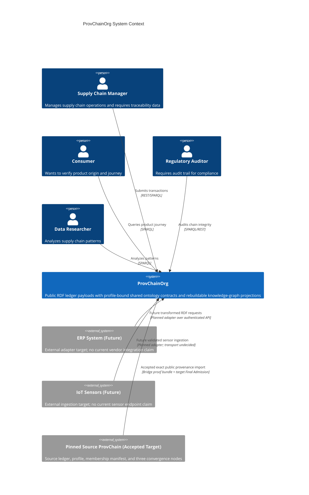

# ProvChainOrg System Context Documentation

## C4 Model: Level 1 - System Context

**Version:** 1.3
**Last Updated:** 2026-08-31
**Author:** Anusorn Chaikaew (Student Code: 640551018)
**Thesis:** Enhancement of Blockchain with Embedded Ontology and Knowledge Graph for Data Traceability

---

## 1. System Overview

### 1.1 System Purpose

ProvChainOrg is a distributed-ledger research prototype whose blocks carry public RDF provenance
payloads and whose Network Profile binds a separately versioned shared ontology package and
semantic execution profile. Current Oxigraph and index paths expose knowledge-graph projections,
but verified rebuild of every projection from the sole complete-envelope journal is an accepted
target with implementation and recovery evidence pending. Ontology and SHACL assets are semantic
contracts, not files embedded in every block. The system is designed to investigate supply-chain
traceability and medical-data reference cases where:

- **Data traceability** is critical for regulatory compliance and consumer safety
- **Semantic understanding** of relationships between transactions is required
- **Permission control** at the data owner level is necessary
- **Bounded inter-ledger provenance import** is an accepted reference-system architecture for collaboration between explicitly trusted ProvChain networks

### 1.2 Claim-status legend

- **Current foundation** means code or a narrowly scoped test exists, but does not by itself prove
  the accepted end-to-end architecture.
- **Accepted target** means the normative thesis reference-system contract is locked by ADR;
  implementation and reproducible evidence may remain pending.
- **Future work** is not part of the locked thesis claim.

### 1.3 System Scope

**Current foundation:**

- Rust blockchain, RDF payload, Oxigraph/SPARQL, HTTP/JWT, WebSocket, Ed25519, and
  ChaCha20-Poly1305 code paths;
- shared-ontology/SPACL modules and a legacy single-process bridge prototype; and
- development tests and benchmarks that must remain scoped to their exact topology and workload.

**Accepted thesis target:**

- three-node Scheduled-Authority PoA convergence over exact committed envelopes;
- one universal fail-closed Final Admission boundary;
- complete Admitted Block Envelope append plus `fsync` as the sole commit point, with the
  in-memory chain, Oxigraph, and indexes rebuilt as projections;
- governance-signed membership and mutually authenticated peer sessions;
- package-declared, full-staged-union SHACL enforcement with non-vacuous candidate focus;
- journal-authoritative durable privacy lifecycle; and
- bounded, one-hop, exact-public-payload ProvChain-to-ProvChain import.

**Future work:**

- PBFT, heterogeneous/SPV or multihop bridges, ERP/IoT product integrations, human usability
  studies, operational deployment, and production-pilot controls.

**Out of Scope:**
- Smart contract execution (intentional trade-off)
- Cryptocurrency/financial transaction processing
- General-purpose computing platform

---

## 2. System Context Diagram



---

## 3. Stakeholders

| Stakeholder | Role | Interests | Requirements |
|-------------|------|-----------|--------------|
| **Supply Chain Manager** | Primary User | Efficient data submission, query capabilities | Evidence-scoped query response and admitted-request receipts |
| **Consumer** | End User | Product verification, safety information | Simple query interface, mobile-friendly |
| **Regulatory Auditor** | Compliance | Complete audit trail, data integrity | Tamper-evident records, SPARQL access |
| **Data Researcher** | Analyst | Pattern discovery, analytics | Complex query support, export capabilities |
| **System Administrator** | Operations | System health, maintenance | Monitoring, alerting, backup tools |
| **Thesis Committee** | Academic Review | Research validation, reproducibility | Documentation, experimental results |

---

## 4. External Systems

### 4.1 Future ERP System Integration

**Status:** Future integration target; not current implementation or thesis evidence.

**Purpose:** Automated transaction submission from enterprise systems through an explicit adapter.

**Potential protocol:** An authenticated REST adapter may reuse current HTTP/JWT foundations, but
vendor authentication, transformation, retries, and end-to-end admission receipts are not
implemented as an ERP integration.

**Data Flow:**
```
ERP System → Future adapter/transformation → unsigned request → target Final Admission → receipt
```

**Use Cases:**
- batch transaction submission under an evidence-defined bound;
- automated supply-chain event transformation to the pinned ontology package; and
- separately tested connectors for any selected ERP vendor.

### 4.2 Future IoT Sensor Integration

**Status:** Future integration target; not current implementation or thesis evidence.

**Purpose:** Validated sensor ingestion for cold-chain monitoring.

**Potential protocol:** A future adapter may use WebSocket or MQTT. The current generic `/ws`
event-subscription endpoint is not an IoT-ingestion contract, and `/ws/iot` is not a current route.

**Candidate future data types (not a current wire schema):**
- Temperature readings (2-8°C for pharmaceuticals)
- GPS location tracking
- Humidity levels
- Shock/vibration events

**Data Flow:**
```
IoT Device → Future authenticated adapter → package-valid RDF request → target Final Admission
```

### 4.3 Bounded ProvChain-to-ProvChain Bridge

**Purpose:** One-hop copying of one exact public RDF payload from an explicitly pinned source
ProvChain ledger into a target ProvChain ledger.

**Protocol:** `ProvChainBridgeSuiteV1` under
[ADR 0037](./ADR/0037-bound-provchain-bridge-to-converged-source-evidence-and-final-admission.md).
The source commits a target-bound export declaration and all three pinned source nodes attest the
same envelope and prefix under the pinned strict receipt verifier and feature graph. One PoA
Proposal Coordinator serializes all unsigned target request kinds and durably fences one exact
proposal before the target Scheduled Authority signs. Only work that remains unselected, has not
begun fence persistence, and has not invoked the signer may refresh to a later parent. The authority
then presents the unchanged payload and exact Bridge Origin Evidence to normal target Final
Admission, including mandatory target package/SHACL enforcement. Only target journal append plus
`fsync` creates terminal Imported state; the Signing Fence is not a commit authority.

**Use Cases:**
- controlled provenance exchange between two ProvChain consortia using the same state, semantic,
  and ontology-package contract;
- thesis evidence for source and target three-node convergence; and
- audit of exact source-to-target provenance origin.

The accepted v1 design excludes lock/mint, asset transfer, RDF/ontology mapping, private data,
multihop relaying, heterogeneous ledgers, and SPV. Current `src/interop/bridge.rs` is a legacy
single-process prototype and does not implement this contract.

---

## 5. Key Quality Attributes

Quality attributes below are objectives and evidence boundaries. They are not declarations of
current production service levels.

### 5.1 Performance

| Property | Evidence required | Current status |
|----------|-------------------|----------------|
| Admission throughput/latency | Reproducible workload that includes the declared semantic package, journal `fsync`, and topology | Narrow development benchmarks only; no end-to-end claim |
| SPARQL latency | Dataset, query corpus, cache state, hardware, and percentile method archived with results | Evidence-scoped measurements only |
| PoA convergence latency | Three authenticated processes, exact-envelope replication, and three matching receipts | Accepted target; evidence pending |
| Semantic validation/reasoning cost | Package version, shapes, full staged union, candidate focus, and warm/cold state recorded | Accepted target; evidence pending |

### 5.2 Reliability

| Property | Accepted behavior/evidence boundary | Current status |
|----------|-------------------------------------|----------------|
| Node commitment | Complete envelope journal append plus `fsync` is the only commit event | Accepted target; implementation/recovery evidence pending |
| Three-node convergence | All three pinned nodes durably commit the same exact envelope and prefix before convergence is claimed | Accepted target; evidence pending |
| Missed PoA turn | Stall safely; no authority takeover, peer shortcut, or fork-choice rule | Accepted target; evidence pending |
| Recovery | Replay projections from verified journal envelopes after crash/restart | Accepted target; evidence pending |
| PBFT/availability SLO | Requires a separate fault campaign and operational deployment | Future work; no current claim |

### 5.3 Security

| Property | Evidence boundary | Current status |
|----------|-------------------|----------------|
| Client authentication | JWT route behavior is a current foundation; MFA is not claimed | Partial foundation |
| Peer identity/membership | Governance-signed manifest plus mutual Ed25519 challenge-response for every peer session | Accepted target; implementation/evidence pending |
| Privacy authorization | `PrivacyControlV1`, owner-authorized transitions, versioned participant keys, and journal-derived effective state | Accepted target; implementation/evidence pending |
| Protected payloads | Pinned suite, immutable ciphertext, per-object DEK envelopes, and durable client-only private-key custody | Accepted target; implementation/evidence pending |
| Auditability | Replayable complete envelopes plus archived, corrected, reproducible evidence | Accepted target; implementation/evidence pending |

### 5.4 Scalability

The locked thesis topology is three nodes per ProvChain network (six processes for bridge evidence),
not a production scale-out claim. Transactions/day, concurrent-user capacity, multi-terabyte
storage, node counts beyond the evidence topology, and horizontal scaling remain future operational
milestones until a reproducible deployment campaign establishes them.

---

## 6. Business Domain Model

### 6.1 Core Concepts

The following is an illustrative domain/reference-package model, not a claim that these exact
classes, properties, or OWL inferences are mandatory in every deployed network.

```
┌─────────────────────────────────────────────────────────────┐
│                   BUSINESS DOMAIN MODEL                     │
├─────────────────────────────────────────────────────────────┤
│                                                             │
│  ┌──────────────┐      ┌──────────────┐                  │
│  │   Product    │──────│ Transaction  │                  │
│  │              │      │              │                  │
│  │ - lotNumber  │      │ - timestamp  │                  │
│  │ - productName│      │ - type       │                  │
│  │ - origin     │      │ - location   │                  │
│  │ - currentLoc │      │ - handler    │                  │
│  └──────────────┘      └──────────────┘                  │
│         │                      │                           │
│         └──────────┬───────────┘                           │
│                    │                                       │
│         ┌──────────▼──────────┐                           │
│         │  Certification      │                           │
│         │                     │                           │
│         │ - type              │                           │
│         │ - issuedBy          │                           │
│         │ - validUntil        │                           │
│         └─────────────────────┘                           │
│                                                             │
│  OWL2 Relationships:                                       │
│  - ex:suppliedBy (transitive via property chain)           │
│  - ex:hasCertification (qualified cardinality)            │
│  - ex:lotNumber (hasKey uniqueness constraint)             │
└─────────────────────────────────────────────────────────────┘
```

### 6.2 Use Case Summary

| Use Case | Actor | Description | Claim status |
|----------|-------|-------------|--------------|
| Submit RDF request | Supply Chain Manager | Submit a supply-chain event for admission | Current API foundation; universal admission target pending |
| Trace Product | Consumer | Query projected provenance state | Current query foundation; evidence workload pending |
| Audit Chain | Auditor | Verify journal envelopes, prefix, and rebuilt projections | Accepted target |
| Bounded Bridge Import | Bridge Relayer | Deliver an exact source proof and public payload to target admission | Accepted target; six-process campaign pending |
| Analytics Query | Researcher | Run evidence-scoped SPARQL analysis | Current query foundation |

---

## 7. Technology Stack Overview

### 7.1 Core Technologies

```
┌─────────────────────────────────────────────────────────────┐
│                   TECHNOLOGY STACK                         │
├─────────────────────────────────────────────────────────────┤
│                                                             │
│  Application Layer:                                         │
│  - Axum (Web Framework)                                     │
│  - JWT (jsonwebtoken)                                       │
│  - Tokio (Async Runtime)                                    │
│                                                             │
│  Current foundation:                                        │
│  - Axum/JWT HTTP and generic WebSocket APIs                 │
│  - Rust blockchain/RDF, Oxigraph/SPARQL, Ed25519            │
│  - ChaCha20-Poly1305 and SPACL modules                      │
│                                                             │
│  Accepted target:                                           │
│  - Scheduled-Authority PoA + authenticated membership      │
│  - Universal Final Admission + sole journal commit         │
│  - Package/full-union SHACL + rebuildable projections      │
│  - Durable privacy lifecycle + bounded exact bridge        │
│                                                             │
│  Future work: PBFT, ERP/IoT products, operational scale    │
│                                                             │
└─────────────────────────────────────────────────────────────┘
```

### 7.2 Dependencies

**Current build/runtime dependencies:**
- Rust 1.87+ (Edition 2021)
- Cargo project with `owl2-reasoner` from SPACL as a Git dependency
- Docker (for deployment and benchmarking)

**External services:** The core reference system does not require an ERP, IoT broker, or third-party
bridge authority. Deployment monitoring, identity operations, backups, and future adapters are
separate operational choices; this document makes no fully decentralized production claim.

---

## 8. Constraints and Limitations

### 8.1 Technical Constraints

| Constraint | Impact | Mitigation |
|------------|--------|------------|
| No smart contracts | Limited programmability | Focus on data traceability |
| RDF storage overhead | Larger block size | Compression, pruning |
| OWL2 reasoning performance | Query latency | Caching, optimization |

### 8.2 Business Constraints

| Constraint | Impact | Mitigation |
|------------|--------|------------|
| Thesis timeline | Feature scope | Prioritize core innovations |
| Single developer | Bus factor = 1 | Documentation, modular design |
| Academic validation | Rigorous testing required | Comprehensive benchmark suite |

---

## 9. Open Questions

1. **Production Deployment:** What is the path from research prototype to production system?
2. **Consensus Upgrade:** How to upgrade consensus protocol without chain fork?
3. **Privacy Regulations:** GDPR compliance for immutable blockchain data?
4. **Quantum Threat:** Timeline for NIST post-quantum cryptography migration?

---

## 10. Related Documentation

- [Container Architecture](./CONTAINER_ARCHITECTURE.md) - C4 Level 2
- [Component Architecture](./COMPONENT_ARCHITECTURE.md) - C4 Level 3
- [Architecture Decision Records](./ADR/) - Historical decisions
