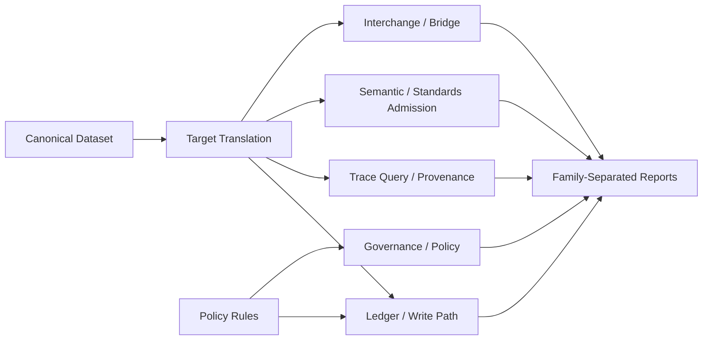

# Benchmark Metrics Strategy - 2026-04-24

## Purpose

เอกสารนี้ตอบคำถามเดียวให้ชัด:

เราจะวัด benchmark ด้วยเมทริกอะไร และจะตีความผลอย่างไรโดยไม่เปรียบเทียบระบบผิดประเภท

เอกสารนี้เป็นแผนเมทริกใช้งานจริง ไม่ใช่รายการเอกสารทั้งหมดของ benchmark program

## Strategy Summary

`ProvChain` ไม่ควรถูกเทียบกับทุก product ด้วยตัวเลขเดียว เช่น `TPS` หรือ `latency` รวม เพราะแต่ละ product มีขอบเขตไม่เหมือนกัน

กลยุทธ์ที่ใช้คือ:

1. แยก benchmark เป็นหลายกลุ่มความสามารถ
2. เลือกคู่เทียบตามกลุ่มความสามารถนั้น
3. รายงานเมทริกหลักและเมทริกวินิจฉัยแยกกัน
4. ไม่ประกาศผู้ชนะรวมข้ามทุกกลุ่ม
5. ใช้เฉพาะผลที่ระบบคู่เทียบทำงานสำเร็จจริง

## Benchmark Families

## Metric Matrix

| Family | Research question | Products to compare | Primary metrics | Diagnostic metrics | Current status |
|---|---|---|---|---|---|
| `A. Ledger / Write Path` | ระบบใดรับข้อมูลและ commit ได้เร็วและเสถียรที่สุด | `ProvChain`, `Fabric`, `Geth`, `Fluree`; `Neo4j` only as secondary baseline | `submit_latency_ms`, `commit_latency_ms`, `confirmation_latency_ms`, `throughput_records_per_sec`, `throughput_tx_per_sec` | `batch_commit_latency_ms`, `error_rate`, `recovery_time_ms`, `payload_size_bytes` | ยังไม่ใช่ baseline หลัก; รอ `Fabric` และ `Geth` real adapter |
| `B. Trace Query / Provenance` | ระบบใดค้นย้อน provenance ได้เร็วและถูกต้องที่สุด | `ProvChain`, `Neo4j`, `Fluree` | `query_p50_ms`, `query_p95_ms`, `query_p99_ms`, `success_rate`, `result_count`, `query_throughput_qps` | `records_scanned`, `response_size_bytes`, `query_error_body`, `warmup_latency_ms` | พร้อมใช้งานสำหรับ `ProvChain vs Neo4j`; `Fluree` ยัง block |
| `C. Semantic / Standards Admission` | ต้นทุนการรับข้อมูลแบบ RDF, JSON-LD, ontology, validation เป็นเท่าใด | `ProvChain`, `Fluree`; ระบบอื่นต้องนับ external pipeline | `mapping_latency_ms`, `rdf_or_jsonld_ingest_latency_ms`, `semantic_validation_latency_ms`, `end_to_end_admission_latency_ms` | `explanation_latency_ms`, `validation_failure_reporting_latency_ms`, `invalid_payload_rejection_rate` | ยังไม่พร้อมเป็น cross-product evidence |
| `D. Governance / Policy` | เมื่อต้องบังคับ policy และ permission ระบบมี overhead เท่าใด | `ProvChain`, `Fabric`; `Geth` conditional | `policy_check_overhead_ms`, `authorized_read_latency_ms`, `unauthorized_rejection_latency_ms`, `write_with_policy_latency_ms` | `policy_cache_hit_rate`, `rejection_reason_accuracy`, `throughput_under_policy_controls` | กำลังเตรียมผ่าน `Fabric` contract/gateway design |
| `E. Interchange / Bridge` | การ export, transform, validate, import ระหว่างระบบมีต้นทุนเท่าใด | `ProvChain` plus target-specific peer | `export_latency_ms`, `transform_latency_ms`, `validation_latency_ms`, `import_latency_ms`, `round_trip_consistency_rate` | `mapping_loss_count`, `schema_violation_count`, `replay_success_rate` | ยังเป็นแผนอนาคต ไม่ใช่ competitive result |

## Workload Matrix

| Workload | Family | Scenario | Primary products | Primary metrics |
|---|---|---|---|---|
| `W1` | A | single record insert | `ProvChain`, `Fabric`, `Geth`, `Fluree` | `submit_latency_ms`, `commit_latency_ms` |
| `W2` | A | batch insert sizes `10`, `100`, `1000` | `ProvChain`, `Fabric`, `Geth`, `Fluree` | `throughput_records_per_sec`, `batch_commit_latency_ms` |
| `W3` | B | single-entity lookup | `ProvChain`, `Neo4j`, `Fluree` | `query_p50_ms`, `query_p95_ms`, `success_rate` |
| `W4` | B | one-hop trace | `ProvChain`, `Neo4j`, `Fluree` | `query_p50_ms`, `query_p95_ms`, `result_count` |
| `W5` | B | three-hop trace | `ProvChain`, `Neo4j`, `Fluree` | `query_p50_ms`, `query_p95_ms`, `result_count` |
| `W6` | B | full provenance reconstruction | `ProvChain`, `Neo4j`, `Fluree` | `query_p50_ms`, `query_p95_ms`, `records_scanned` |
| `W7` | C | semantic admission | `ProvChain`, `Fluree` | `semantic_validation_latency_ms`, `end_to_end_admission_latency_ms` |
| `W8` | D | policy-enforced write | `ProvChain`, `Fabric` | `write_with_policy_latency_ms`, `policy_check_overhead_ms` |
| `W9` | D | policy-enforced read | `ProvChain`, `Fabric` | `authorized_read_latency_ms`, `unauthorized_rejection_latency_ms` |
| `W10` | E | cross-system export/import | `ProvChain` plus target | `round_trip_consistency_rate`, `import_latency_ms` |

## Report Schema Required For Every Result Row

ทุกแถวในผล benchmark ควรมี field เหล่านี้เป็นอย่างน้อย:

| Field | Meaning |
|---|---|
| `run_id` | รหัส run แบบ timestamp หรือกำหนดเอง |
| `benchmark_family` | กลุ่ม benchmark เช่น `trace_query`, `ledger_write`, `semantic_admission` |
| `scenario` | workload หรือ query scenario |
| `dataset_slice` | ชุดข้อมูล logical ที่ใช้ |
| `system` | product ที่ถูกวัด |
| `capability_path` | `native`, `secondary`, `external_pipeline`, หรือ `indexed_stack` |
| `fairness_label` | label ที่ใช้ตีความผล |
| `success_rate` | อัตราความสำเร็จ |
| `p50_ms` | median latency |
| `p95_ms` | tail latency ระดับ 95 percent |
| `p99_ms` | tail latency ระดับ 99 percent |
| `mean_ms` | ค่าเฉลี่ย |
| `stddev_ms` | ความแปรปรวนของ latency |
| `throughput_per_sec` | throughput ถ้า scenario นั้นใช้ได้ |
| `result_count` | จำนวนผลลัพธ์สำหรับ query scenario |
| `error_summary` | สรุป error ถ้ามี |
| `environment_manifest_id` | pointer ไปยัง environment manifest |

## Fairness Labels

| Label | Use when |
|---|---|
| `native-comparable` | ทั้งสองระบบมีความสามารถใน stack จริงและวัด family เดียวกัน |
| `secondary-baseline` | ใช้เทียบเป็น baseline ทางวิศวกรรม แต่ไม่ใช่ความสามารถชนิดเดียวกันเต็มรูปแบบ |
| `externalized-semantic-pipeline` | ระบบต้องพึ่ง pipeline ภายนอกสำหรับ RDF, JSON-LD, SHACL, หรือ validation |
| `indexed-query-stack` | ระบบ ledger ใช้ index/query layer เพิ่มเติมเพื่อทำ trace query |
| `not-comparable` | ไม่ควรตีความเป็นคู่เทียบโดยตรง |
| `blocked` | adapter หรือ runtime contract ยังไม่ผ่าน |

## Current Interpretation Rules

### What We Can Say Now

จากสถานะปัจจุบัน พูดได้เฉพาะ:

- `ProvChain vs Neo4j` ใน `Family B. Trace Query / Provenance`
- `ProvChain` และ `Neo4j` ผ่าน trace-query scenarios ใน baseline ล่าสุด
- ผลนี้ใช้เป็น engineering baseline ได้

### What We Must Not Say Yet

ยังไม่ควรพูดว่า:

- `ProvChain` ชนะทุก product
- `ProvChain` ชนะ `Fluree`, `Fabric`, หรือ `Geth`
- benchmark นี้เป็น publication-grade multi-product comparison เต็มรูปแบบ
- write-path result ของ `Neo4j` เทียบเท่า ledger finality

## Execution Order

ลำดับที่ควรทำต่อ:

1. รักษา `ProvChain vs Neo4j` ใน `Family B` เป็น baseline หลัก
2. ทำ `Fabric` สำหรับ `Family A` และ `Family D`
3. กลับมาแก้ `Fluree` สำหรับ `Family B` และ `Family C` เมื่อ runtime contract ชัด
4. เพิ่ม `Geth` สำหรับ `Family A` หลังนิยาม confirmation semantics แล้ว
5. สร้าง campaign หลาย epoch เมื่อมี comparator มากกว่าหนึ่งตัวที่ทำงานจริง

## Minimum Validity Gate

ผล benchmark หนึ่ง scenario จะใช้เปรียบเทียบได้เมื่อผ่านเงื่อนไขทั้งหมด:

1. local contract tests ผ่านก่อนรัน Docker
2. ทุกระบบใน scenario มี `success_rate > 0`
3. ใช้ logical dataset และ logical scenario เดียวกัน
4. ระบุ `benchmark_family`, `dataset_slice`, `capability_path`, และ `fairness_label`
5. บันทึก environment manifest และ Docker image identity
6. แยก `submit`, `commit`, และ `confirmation` เมื่อวัด ledger
7. นับ external pipeline ถ้าระบบไม่มี semantic capability แบบ native

## Decision

เมทริกหลักของโครงการไม่ใช่ตัวเลขเดียว แต่เป็นชุดเมทริกตาม family:

- ถ้าวัดการเขียนและ finality ใช้ `Family A`
- ถ้าวัด traceability ใช้ `Family B`
- ถ้าวัด semantic/standards ใช้ `Family C`
- ถ้าวัด permission/policy ใช้ `Family D`
- ถ้าวัดการแลกเปลี่ยนข้อมูลข้ามระบบ ใช้ `Family E`

รายงานสุดท้ายต้องแยกตารางตาม family เสมอ และห้ามทำตารางผู้ชนะรวมที่รวมทุก product ทุกความสามารถไว้ด้วยกัน
